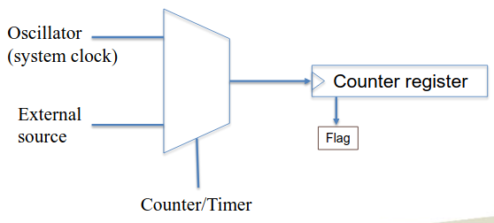
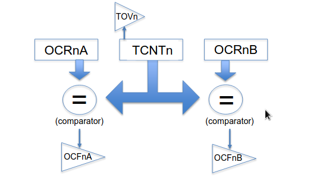

# Counters and Timers

Its the same internal structure. The difference is whether its connected to system clock or an external event.

But whats wrong with delays? Delays stop everything the CPU is doing. The timers don’t. When they hit the “time”, they interrupt, but it lets things run instead of it. 

There are 3 timers.

timer/counter 0 and 2 are 8bit, with a 256 step resolution. Timer/counter 1 is a 16 bit timer, with a 65k step resolution.

==**Remember: Frequency = 1/time**==

==The clock on the arduino is 16Mhz. This works out to 62.5ns. This will most likely be tested on.==

TCNTn is the generic way of referring to a counter register. You can read or write to this register. This makes something like a stopwatch easy to implement. (write 0s, do something, read the register)

Timer0 and Timer2 will roll over after $16\mu s$, so don’t expect it to go farther than that. Timer1 is for long-term timing (maxes out at 1ms)

But timers aren’t this simple. You can do more fun things with them, and less difficult things as well.

## Timer Registers

### Output Comparator Registers

You can set OCRnA and OCRnB to a specific value. When the TCNT hits the value in OCR, then the OCF will go high. The TOV goes high to let you know that the TCNT has rolled over. 

Timer0 information:

- `TCNT0`
- `OCR0A`
- `OCR0B`

Timer2 information:

- `TCNT2`
- `OCR2A`
- `OCR2B`

Timer1 information:

- `TCNT1H` (15:8)
- `TCNT1L` (7:0)
- `OCR1AH`
- `OCR1AL`
- `OCR1BH`
- `OCR1BL`

### Timer Control Registers

`TCCRnA` and `TCCRnB` control the functionality of the timers.

- the mode of operation
- what to do on compare match
- force output compare
- fast PWM mode
- Phase Corrected PWM mode
- more that haven’t been discussed (:sadface:)

#### Normal mode

Simplest. Counter counts, then rolls over. 

Used for counting ticks.

#### CTC mode

clears timer to 0 when `TCNTn ` matches `OCRnA`.

Eventually, we’ll use Fast PWM, and Phase Corrected PWM once or twice, but these are about it.

`TCCRnB` does clock-division, while `TCCRnA` does the above shown tasks.