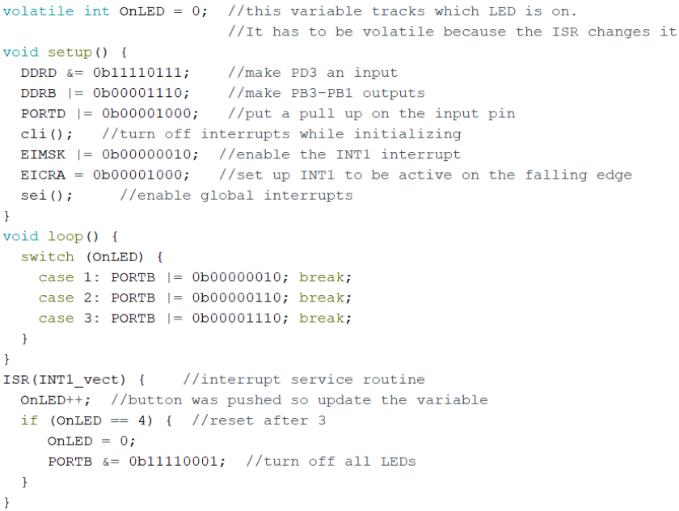

# External Interrupts

These are PD2 and PD3. labeled as `INTn` with the logical vector.

Changing bits 1 and 0 in `EIMSK` enables those interrupts. `EICRA` determines when the interrupt is triggered.


steps:

- [ ] `cli();`
- [ ] Enable your specific detection mode `EICRA`
- [ ] set appropriate bits in `EIMSK`
- [ ] `sei();`


# Volatile and Static variables

## Volatile

Denotes variables changable in the ISR. 



## Static

used when a variable should keep its value between ISR calls

# Coding problem

Create a game show setup

- [ ] each contestant has the ability to force PD4-PD7 low
- [ ] first to buzz in lights up PB0-PB3 respectively
- [ ] interrupt definition for who buzzed first

Tasks

- [x] initialize ports
- [x] initialize interrupts
- [x] write ISR

```c
void setup(){
    DDRB |= 0x0F;
    DDRD &= 0x0F;
    PORTB &= 0xF0;
    PORTD |= 0xF0;
    cli();
    PCICR  = 4;
    PCMSK2 = 0xF0;
    sei();
}

void loop(){
    while(1){}
}

ISR(PCINT2_vect){
    byte inputPins = PIND;
    if(inputPins & 0x10) {
        PORTB |= 0x01;
        PORTB &= 0xF1;
    }
    if(inputPins & 0x20) {
        PORTB |= 0x02;
        PORTB &= 0xF2;
    }
    if(inputPins & 0x40) {
        PORTB |= 0x04;
        PORTB &= 0xF4;
    }
}
```

