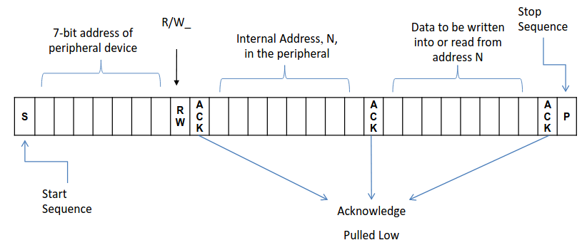

# I^2^C

Inter integrated circuits

- standard serial bus protocol
- enables communicationbetween microprocessor and peripherals
- 2 wires in the interface
    - clock
        - `SCL ` or `SCLK`
        - provided by master
        - uni-directional
    - data
        - `SDA` or `SDAT`
        - bi-directional
- inexpensive and simple

Arduino calls it 2-wire serial interface

Broadcasting is possible

Data should only change when `SCLK` is low. Both signals idle high. The master initiates the transfer by pulling `SDAT` low while holding `SCLK` high. To end the transmission the master pulls `SCLK` high. 

