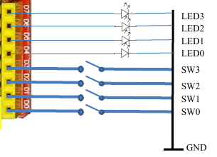

# Skyler MacDougall

## Homework 2: Due 1/29/2020

1. Rewrite Lab 1, page 15, using C and register writes. ArduinoC is allowed for the use of Serial outputs and delays.

    ```c
    //Lab_1_hello_arduino
    //#define LED_PIN  13
    char inChar;
    boolean isFreshInChar;
    
    void setup() {
      DDRB |= 0x20; //pinMode(LED_PIN , OUTPUT);
      PORTB &= 0xDF; //digitalWrite(LED_PIN , LOW);
      
      // Set serial monitor console termination for 'No line ending'
      Serial.begin(9600);
      Serial.println("Lab 1: hello arduino v0.3\n");
      delay(5000);
    }
    
    void loop() { 
      isFreshInChar = false;  
      if (Serial.available()) {
        inChar = Serial.read();
        Serial.print("Serial input detected: ");
        Serial.println(inChar);
        isFreshInChar = true;
      }
    
      if (inChar == 'n') PORTB |= 0x20; //digitalWrite(LED_PIN , HIGH); oN
      if (inChar == 'f') PORTB &= 0xDF; //digitalWrite(LED_PIN , LOW);  oFf
    
      if (inChar == 'b') { // blink with 25% duty cycle
        PORTB |= 0x20; //digitalWrite(LED_PIN , HIGH);
        delay(250);
        PORTB &= 0xDF; //digitalWrite(LED_PIN , LOW);
        delay(750);
      }
    
      // Discover 't' persistence bug by observing high rate LED blink
      if (inChar == 't') { // toggle
        //digitalWrite(LED_PIN , !digitalRead(LED_PIN ));
        if (PINB & 0x20){
            PORTB &= 0xDF;
        }
        else{
            PORTB |= 0x20;
        }
      }
    
      // Add state change detection to get proper toggle action.
      if (inChar == 'T') { // toggle
        if (isFreshInChar){//digitalWrite(LED_PIN , !digitalRead(LED_PIN ));
       	if (PINB & 0x20){
            PORTB &= 0xDF;
        }
        else{
            PORTB |= 0x20;
        }
        }
      }
    
    } // loop()
    ```
    
2. Assuming the below, write a program using register reads and writes, read the state of the switches and turn the LEDs on if the switches are closed.
    

    ```c
    void setup(){
        DDRB = 0xF0;
    PORTB = 0x0F;
    }
    
    void loop(){
        //LED0
        if(PINB & 0x01){
            PORTB |= 0x10;
        }
        else{
            PORTB &= 0xEF;
        }
        //LED1
        if(PINB & 0x02){
            PORTB |= 0x20;
        }
        else{
            PORTB &= 0xCF;
        }
        //LED2
        if(PINB & 0x04){
            PORTB |= 0x40;
        }
        else{
            PORTB &= 0xBF;
        }
        //LED3
        if(PINB & 0x08){
            PORTB |= 0x80;
        }
        else{
            PORTB &= 0x7F;
        }
    }
    ```
    
3. Explain the steps necessary when changing the state of a port from input to output, or vice versa. 

    ```c
   //The following is a step by step for how to go from in to out.
   PORTD = 0x00;
   DDRD  = 0xFF;
   //The following is a step by step for how to go from out to in
   DDRD  = 0x00;
   PORTD = 0xFF;
   ```
   
   The steps stated above are for full ports. The process is similar for single pin assignment.