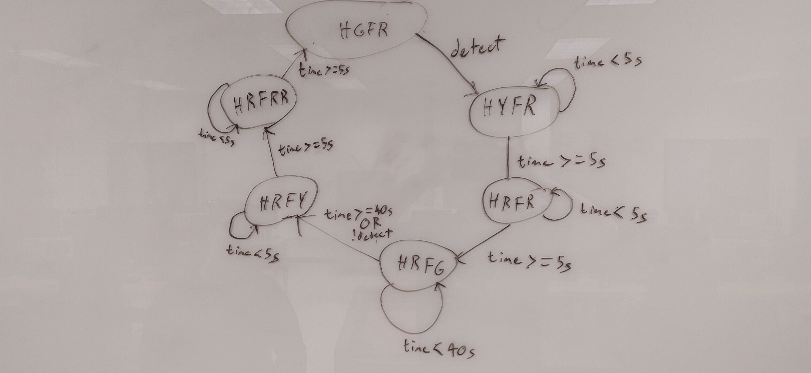
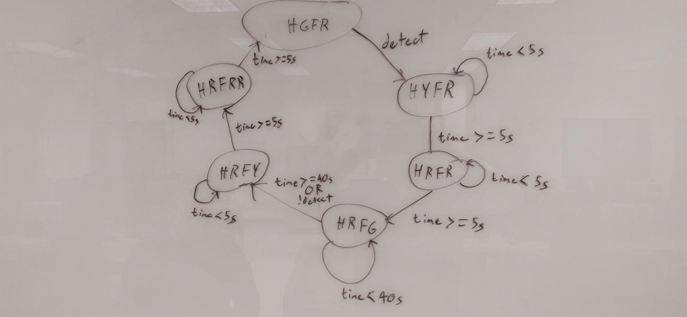

3. 



```c
enum{HGFR, HYFR, HRFR, HRFG, HRFY, HRFRR, HRRFRR};
bool detect = false;
int state = HRFRR, prevState = !state;
float stateTimer = 0;
boolean isNewState;
void setup(){
    DDRD |= 0xFC; //setting light pins to output
    DDRB &= ~(0x01); //set detect pin to input
    PORTB |= 0x01; //turn on detect pin pullup
}

void loop(){
    detect = (PINB & 0x01);
    isNewState = (state != prevState);
    prevState = state;
    switch(state){
        case HGFR:
            if(isNewState){
                PORTD &= ~(0x80);
                PORTD |= 0x30;
            }
            if(detect) state = HYFR;
            break;

        case HYFR:
            if(isNewState){
                PORTD &= ~(0x20);
                PORTD |= 0x40;
                stateTimer=0;
            }
            if(!(isNewState)){
                stateTimer++;
            }
            if(stateTimer >= 5000)state = HRFR;
            break;

        case HRFR:
            if(isNewState){
                PORTD &= ~(0x40);
                PORTD |= 0x80;
                stateTimer=0;
            }
            if(!(isNewState)){
                stateTimer++;
            }
            if(stateTimer >= 5000)state = HRFR;
            break;

        case HRFG:
            if(isNewState){
                PORTD &= ~(0x10);
                PORTD |= 0x04;
                stateTimer=0;
            }
            if(!(isNewState)){
                stateTimer++;
            }
            if((stateTimer >= 40000) || !(detect)) state = HRFY;
            break;

        case HRFY:
            if(isNewState){
                PORTD &= ~(0x04);
                PORTD |= 0x08;
                stateTimer=0;
            }
            if(!(isNewState)){
                stateTimer++;
            }
            if(stateTimer >= 5000)state = HRFRR;
            break;

        case HRFRR:
            if(isNewState){
                PORTD &= ~(0x08);
                PORTD |= 0x10;
                stateTimer=0;
            }
            if(!(isNewState)){
                stateTimer++;
            }
            if(stateTimer >= 5000)state = HGFR;
            break;

        case HRRFRR:
            if(isNewState){
                PORTD &= ~(0x08);
                PORTD |= 0x10;
                stateTimer=0;
            }
            break;

        default: state = HRRFRR;
    }
    delay(1);
}

```


4. 



```c
enum{fwd, backr, backl, turnr, turnl, stop};
bool rs = false, ls = false;
int state = fwd, prevState = !fwd;
int stateTimer = 0;
#define forward  0xC0
#define rightTurn  0x40
#define leftTurn  0x80
boolean isNewState;
void setup(){
    DDRD |= 0xC0; DDRD &= ~(0x03); //setting input/output pins
    PORTD |= 0x03; //setting pushbutton pullups
}

void loop(){
    rs = !(PIND & 0x02);
    ls = !(PIND & 0x01);
    isNewState = (state != prevState);
    prevState = state;
    switch(state){
        case fwd:
            if(isNewState){
                PORTD |= forward;
            }
            if(rs) state = backr;
            else if(ls) state = backl;
            break;

        case backr:
            if(isNewState){
                PORTD &= ~(forward);
                stateTimer=0;
            }
            if(!(isNewState)){
                stateTimer++;
            }
            if (stateTimer >= 500) state = turnr;
            break;

        case turnr:
            if(isNewState){
                PORTD |= rightTurn;
            }
            if (stateTimer >= 500) state = fwd;
            break;

        case backl:
            if(isNewState){
                PORTD &= ~(forward);
                stateTimer=0;
            }
            if(!(isNewState)){
                stateTimer++;
            }
            if (stateTimer >= 500) state = turnl;
            break;

        case turnl:
            if(isNewState){
                PORTD |= leftTurn;
            }
            if (stateTimer >= 500) state = fwd;
            break;

        case stop:
            if(isNewState){
                PORTD &= ~(forward);
            }
            break;

        default: state = stop;
    }
    delay(1);
}

```

