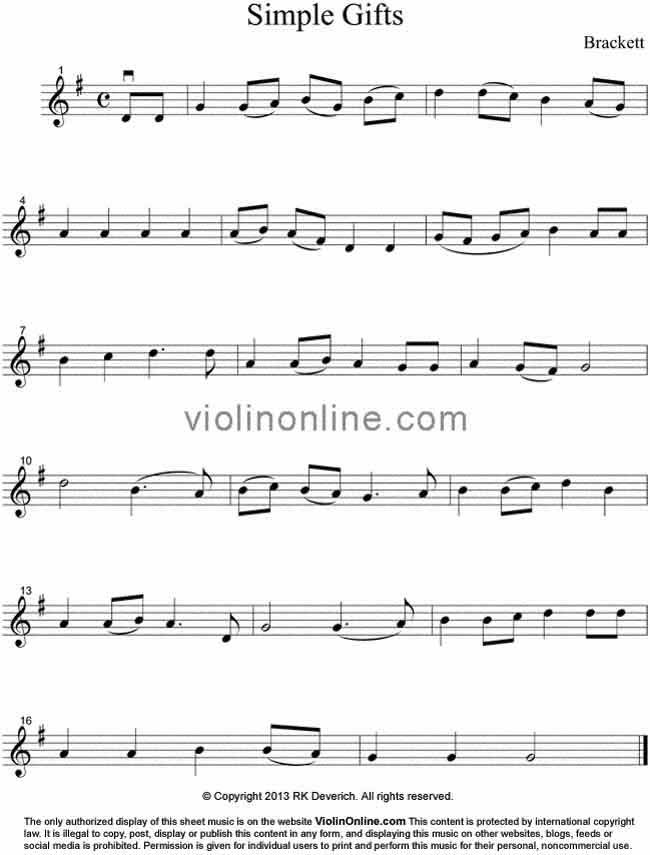

# Skyler MacDougall, Matthew Gerace

# Homework 4: Due 2/12/2020

1. There are 25 notes of the musical scale. They are each produced by a square wave with the frequency as defined by the following formula:
    $$
    f_{note}=440\times 2^{P\over12}\\
    -12\le P\le 12
    $$
    The period of the square wave is as follows:
    $$
    T_{note}={1\over f_{note}}\\
    hint:\ (OCR1A+1)={T_{note}\over 2}={16MHz\over2\times f_{note}}
    $$
    1. For the 25 notes where $220\le f_{note}\le 880$, determine the `OCR1A` values needed to output the square wave of each note using Timer1 in CTC mode.

    2. Open another program and use `#define` to create 25 constants for the results of part 1. Also create time delay constants.
    
    3. In the initialization section setup Timer1 to create a square wave.
    
    4. Create a function called `playNote()`.
    
        1. It takes in an integer representing the max count for a given note and assigns that value to the `OCR1A` register.
        2. It also takes in a delay constant to hold the note for a given amount of time.
        3. it must then turn off CTC mode and `delay(50)` to put a break between notes.
    
    5. In the main loop call the function with different notes and delays in between. You can look up simple songs on the internet and experiment with delays to actually play a song.
    
    6. Use the speaker in your lab kit and drive one pin with the waveform output and the other to ground.



```c
//Note-name/constant conversion
#define LA   36363
#define LAS  34323
#define LB   32396
#define LC   30578
#define LCS  28861
#define LD   27242
#define LDS  25713
#define LE   24270
#define LF   22908
#define LFS  21622
#define LG   20408
#define LGS  19263
#define MA   18182
#define MAS  17161
#define MB   16198
#define MC   15289
#define MCS  14430
#define MD   13620
#define MDS  12856
#define ME   12135
#define MF   11454
#define MFS  10811
#define MG   10204
#define MGS   9631
#define HA    9091

//Note Length definitions
#define QUARTER 400
#define EIGHTH 200
#define DOTQUARTER 600
#define HALF 800

void setup(){
    TCCR1A=0x40;
    TCCR1B=0x09;
    TCCR1C=0;
    TCNT1=0;
    DDRB|=0x02;
}

void playNote(int note, int time){
    OCR1A = note;
    delay(time);
    OCR1A = 0;
    delay(50);
}

void loop(){
    playNote(LD, EIGHTH);
    playNote(LD, EIGHTH);
    playNote(LG, QUARTER);
    playNote(LG, EIGHTH);
    playNote(MA, EIGHTH);
    playNote(MB, EIGHTH);
    playNote(LG, EIGHTH);
    playNote(MB, EIGHTH);
    playNote(MC, EIGHTH);
    playNote(MD, QUARTER);
    playNote(MD, EIGHTH);
    playNote(MC, EIGHTH);
    playNote(MB, QUARTER);
    playNote(MA, EIGHTH);
    playNote(LG, EIGHTH);
    playNote(MA, QUARTER);
    playNote(MA, QUARTER);
    playNote(MA, QUARTER);
    playNote(MA, QUARTER);
    playNote(MA, EIGHTH);
    playNote(MB, EIGHTH);
    playNote(MA, EIGHTH);
    playNote(LFS, EIGHTH);
    playNote(LD, QUARTER);
    playNote(LD, QUARTER);
    playNote(LG, EIGHTH);
    playNote(LFS, EIGHTH);
    playNote(LG, EIGHTH);
    playNote(MA, EIGHTH);
    playNote(MB, QUARTER);
    playNote(MA, EIGHTH);
    playNote(MA, EIGHTH);
    playNote(MB, QUARTER);
    playNote(MC, QUARTER);
    playNote(MD, DOTQUARTER);
    playNote(MD, EIGHTH);
    playNote(MA, QUARTER);
    playNote(MA, EIGHTH);
    playNote(MB, EIGHTH);
    playNote(MA, QUARTER);
    playNote(LG, EIGHTH);
    playNote(LG, EIGHTH);
    playNote(MA, QUARTER);
    playNote(LG, EIGHTH);
    playNote(LFS, EIGHTH);
    playNote(LG, HALF);
    playNote(MD, HALF);
    playNote(MB, DOTQUARTER);
    playNote(MA, EIGHTH);
    playNote(MB, EIGHTH);
    playNote(MC, EIGHTH);
    playNote(MB, EIGHTH);
    playNote(MA, EIGHTH);
    playNote(LG, DOTQUARTER);
    playNote(MA, EIGHTH);
    playNote(MB, QUARTER);
    playNote(MB, EIGHTH);
    playNote(MC, EIGHTH);
    playNote(MD, QUARTER);
    playNote(MB, QUARTER);
    playNote(MA, QUARTER);
    playNote(MA, EIGHTH);
    playNote(MB, EIGHTH);
    playNote(MA, DOTQUARTER);
    playNote(LD, EIGHTH);
    playNote(LG, HALF);
    playNote(LG, DOTQUARTER);
    playNote(MA, EIGHTH);
    playNote(MB, QUARTER);
    playNote(MB, EIGHTH);
    playNote(MC, EIGHTH);
    playNote(MD, QUARTER);
    playNote(MC, EIGHTH);
    playNote(MB, EIGHTH);
    playNote(MA, QUARTER);
    playNote(MA, QUARTER);
    playNote(MB, QUARTER);
    playNote(MB, EIGHTH);
    playNote(MA, EIGHTH);
    playNote(LG, QUARTER);
    playNote(LG, QUARTER);
    playNote(LG, HALF);
    delay(1000);
}
```


2. Use Timer1 in normal mode to create an output wave that has the following properties:
    $$
    f=1Hz\\
    duty\ cycle=25\%
    $$
    Assume that this output is driving an LED that will cause it to blink. You can use a 2-state state machine.
    (Hint: Use `TOV1` as the exit condition for the states. you will need a prescaler.)

    ***DO NOT USE PWM.***

```c
#define OVERFLAG 0x02
#define OVERFLOW 0x01
#define LEDHIGH  0x02
#define LEDLOW   0xFD
enum{LED_on, LED_off, stop};
int state = LED_on, prevState = !LED_on;
int stateTimer = 0;
boolean isNewState;
void setup(){
	TCCR1A = 0x80;
    TCCR1B = 0x04;
    TCCR1C = 0;
    TCNT1 = 65536 - 23437;
    OCR1A = 24520;
    DDRB  |= 0x02;
    PORTB &= ~(0x02);
}

void loop(){
    isNewState = (state != prevState);
    prevState = state;
    switch(state){
        case LED_on:
            if(isNewState)
            {
                PORTB |= LEDHIGH;
                TIFR |= OVERFLOW;//Flag reset
            }
            
            if(TIFR & OVERFLAG) state = LED_off;
            break;
            
        case LED_off:
            if(isNewState)
            {
                PORTB &= LEDLOW;
                TIFR |= OVERFLAG; //Flag reset
            }
            
            if(TIFR & OVERFLOW) state = LED_on;
            break;
            
        case stop:
            PORTB |= 0x02;
            break;
        default: state = stop;
    }
}

```

3. For each group member, discuss the feasibility of the invention. Is it feasible? Why or why not? List the I/O devices that each invention would require.

    1. Skyler MacDougall
    
        one-way switch
    
        - 2 servos
            - 3 pins each
            - 1 servo to move the arm
            - 1 servo to adjust the y-axis to flip the switch
        - 1 switch
            - 1 pin
    
    2. Matthew Gerace
    
        Pool measurement device
    
        ​	Screen for temp and pH readout
    
        I/O devices:
    
        - pH sensor
            - 2 pins
        - thermocouple
            - 2 pins
        - switch
            - 1 pin
            - for changing between pH and temp
        - 2 7seg displays
            - 7 pins per display

