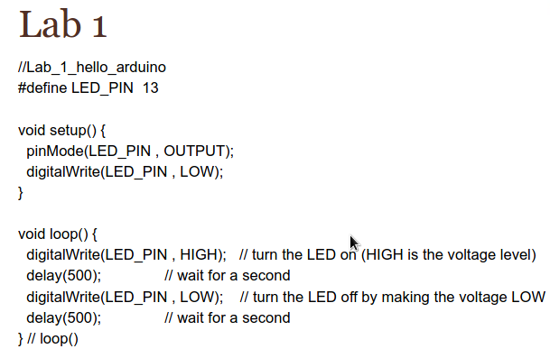

Opening lectures are gonna be real quick, so listen up

# Announcements

- Install arduino IDE
- Download PDF for Atmel
- buy a binder

***Syllabus quiz on Wednesday***

# Basics

Microcontrollers are everywhere.

Microcontrollers have a processor, and D/A or A/D converters. (digital-analog/vice--versa)

Essentially any integrated system has a microcontroller

The board we used last year is what we're using this year. The microcontroller is the Atmel Atmega 328P. The board itself is still an arduino, but its not the microcontroller.

The robot we're making a robot with a visualizer, 2 motorized wheels, an IR module, and a Bluetooth module.

At the end of the semester, we'll come up with our own project.

USE www.Arduino.cc A LOT. There's support, code, etc. etc.

Download the datasheet. There's a lot of pages, so don't print it. Understand it, live with it, sleep with it.

# Ports

## Microcontroller Parts

They have to have the following

- Microprocessor
- Memory
    - flash for program storage (stable memory)
    - RAM for working memory (unstable memory)
- **I/O ports**
- Built in peripherals
    - timers
    - serial interfaces (maybe)
    - A/D and D/A converters (maybe)

What are I/O devices for your PC?

- Keyboard
- Mouse
- Screen
- etc.

What are I/O devices for the microcontroller?

- A/D and D/A for both ins and outs
- Anything that isn't self-contained within the microcontroller is an I/O device

There are 3 ports that we'll use: B, C, D

Each microcontroller has 23 pins for I/O

It is possible to touch the 24th pin, but... just don't.

==This means that Port C only has 7 pins==

Each port can be used pin-by-pin or all of them as a (7 DT 0) vector, or any combination in between.

In output mode, the program puts either VCC or GND on the pin. In input mode, the program reads the voltage on the pin and determines if its VCC or GND.

If VCC is 5 and GND is 0, make sure the input is $\pm 2 \%$

Standard notation is PXn (Pin Port Pin#)

Memorize the pins. Its important.

## Code example

What does this do?

In line order:
line 1 is a comment
line 2 is a definition for readability. In this case, its naming a pin, in the context of the code. It also removes magic numbers.
Line 4-7 is setting up for the loop. Line 5 is defining that pin 13 is an output. (Note: this is not microcontroller pin 5. This is digital pin 13, or PB5.) Line 6 sets an initial state. HIGH and LOW are arduinoC keywords, and 0 and 1 are also acceptable.
Line 9-14 is an infinite loop that flashes the LED. Note that the comment is incorrect, and the delay is for $1 \over 2$ seconds. The measurement of delay is in milliseconds.
(Note: We will eventually learn how to make this in standard C instead of Arduino C) 

# Syllabus Notes

Homework: 15%

Quizzes: 15%

Hour Exams: 40%

- 2/7
- 3/6
- 4/10

Final Exam: 30%

Final Grade:

- 93%+ = A
- 90%+= A-
- 87%+= B+
- 83%+= B
- 80%+= B-
- 77%+= C+

Final Grade = (attended classes / 40) * grade earned