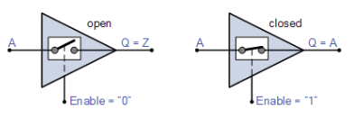

# Hardware of I/O pin

A buffer or an amp is a WYSIWYG part. Its used to ensure that the chip doesn’t burn out (Also, ESD protection and amplification).



There is also a 3-state buffer. This allows for bi-directional output by having a tri-state out and a buffer in from the same line. This is how bi-directional I/O on the microcontroller works.

# Inputs and Pullups

So, we’ve already established how inputs work, using the DDRx (1 for out, 0 for in), PINx (current value), and PORTx (driven value from microcontroller). We’ve also established that pull-ups exist. But how do we force the pin to USE the resistor?

In ArduinoC, we use the `pinMode(x, INPUT_PULLUP);`. We make the pin an input, then write a 1. 

ex.

```c
DDRD &= 0xFB;
PORTD |= 0x04;
```

# Reading Input Pins

If you want to know the value of pin 2, `AND` the PINx register with a mask, where the mask has a 1 in the positions of the bits you care about, and a 0 in the one’s you don’t. If the result is true, its `HIGH`.

```c
if (PIND & 0x04){};
```

The above `AND`ing function works as such. If ALL of the values are `0` then its `FALSE`. If there is ANY OTHER VALUE, it is `TRUE`.

In ArduinoC, the function is `digitalRead(pinNumber)`, and will output a high, or a low.
