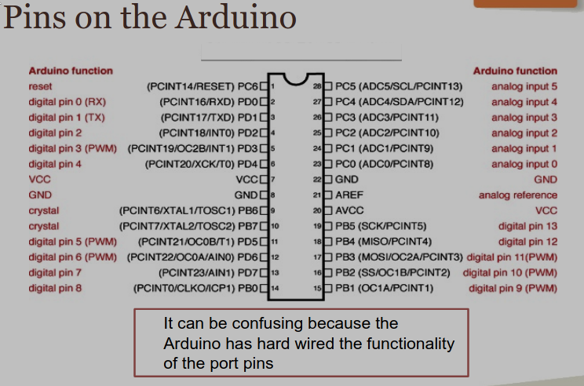
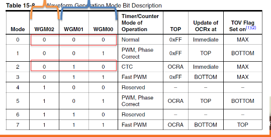
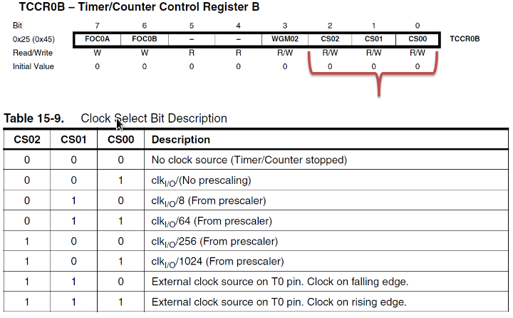
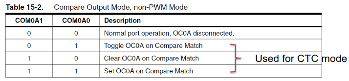
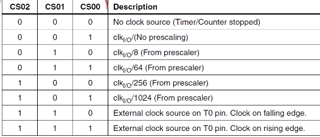

# ==END OF WEEK 3==

---

# Normal Mode

- Constant incrementing
- rollover when clock-space filled
- TIFRx bit 0 returns whether the timer has overflowed. ==***Reset this by writing a 1***==
- Write to the TCNTx to set when the timer should reset. The number is to be subtracted from the timers max before writing. For example
    - 160 count timer: $255-160=95$
    - `TCNT0 = 95;`
    - `if (TIRF0 & 0x01)`
    - `TIFR0 |=0x01;`
        - This will reset the overflow bit

## Code Example ($10\mu s$ delay)

```c
void setup(){
    //initialize i/o
    //initialize timer
}

void loop(){
    //do stuff
    TCNT0 = 95;
    while ((TIFR0 & 0x01) == 0); //wait for 10us
    TIFR0 |= 0x01;
    //do more stuff
}
```

Still inefficient, but interrupts are something we don’t know yet

# CTC Mode

- Counts up from 0 until it reaches `OCRnA`. When they’re equal, `TCNTn` is set back to 0, and the `OCFxA` is set, and counting resets
- Can be used to output a square wave. The output inverts every time `TCNTn` reaches `OCRnA`

# Controlling outputs



Pins `PD3`, `PD5`, `PD6`, `PB1`, `PB2`, and `PB3` are connected to timers. 

3 bit waveform generation:



`WGM02` is bit 3 in `TCCRxB`. `WGM01` and `WGM00` are bits 1 and 0 respectively in `TCCRnA`

Setting Prescaler:



`TCCRnA` bits 7 and 6 are how to set the output pin for `OCnA`. bits 5 and 4 are for `OCnB`, and have the same table.



# Clock Scaling

Each timer has prescaling options to divide down the clock

$t_{elapsed}=cnt\times{N\over16MHz}$

The prescaler for the clock is bits 2-0 in `TCCRnB`

