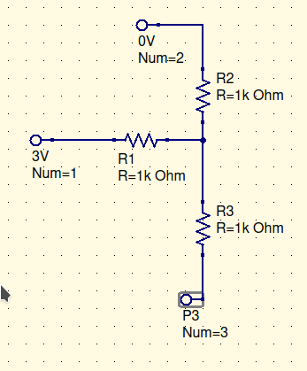
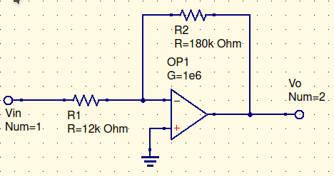
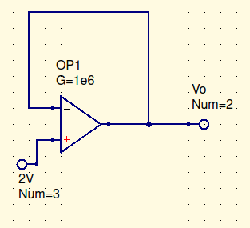

In this instance, assuming traditional current
$$
I_{R2}=2mA
\\
I_{R1}=1mA
\\I_{R3}=1mA
$$
But there’s nothing saying you can’t do it in a different direction and just say its negative. 

Now that we’ve established that, back to the original problem.

# Example 1

(note, the positive and negative are switched in the below diagram)

Givens:
$$
V_+=V_-\\
I_+=0=I_-
$$
There’s three major nodes. There is the positive side of the op amp, the output, and the minus. The output is the only side that has current.

Ultimate goal: Find $I_L$

We know $I_L={6V \over 2k\Omega}=3mA$. But why

now, do the nodal in all locations, recommend starting with the top.
$$
0={V_--0 \over 2k\Omega}+{V_--V_O \over 2k\Omega}\\
V_O=2V_-\\
V_+={V_O\over 2}=V_-\\
0={{V_O\over 2}-6V\over 2k\Omega}+{{V_O\over 2}-0V\over 1.2k\Omega}+{{V_O\over 2}-V_O\over 2k\Omega}\\
0=\cancel{V_O\over 2}-6V-\cancel{V_O\over 2}+{\cancel{2k\Omega} \over 1.2\cancel {k\Omega}}({V_O\over \cancel{2}})\\
6V*1.2=V_O=7.2V\\
{V_+ \over 1.2k\Omega}=i_L\\
{3.6V\over 1.2k\Omega}=i_L=3mA\\
QED
$$

# Inverting Amplifier

Goal: Find ${V_O\over V_{in}}$

$$
0={0-V_{in} \over 12k\Omega}+{0-V_o \over 180k\Omega}\\
V_{O}=15V_{in}\\
{V_O \over V_in}=15\\
QED
$$

# Non-ideal op-amp

So, we can guess that$V_O=0$. Then you become the $V_{CC}$, but it doesn’t make sense.

So, guess $V_O=0=2V$. Then… uh… moving on.

Ulimately, the op-amp has finite gain. Ultimately, $V_+\approx V_-$. This leads to $V_-$ to be some number close to 2V. The output will be pretty much 2V.

This is known as the ==***Voltage Follower***==.

The 2V input is the peak of a sine wave, and the output will get worse as frequency increases.