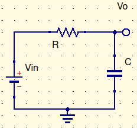
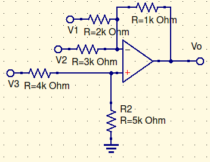

Unity gain frequency = $12MHz$

non-inverting amplifier

Calculate closed loop 3-dB bandwidth for the amplifier if the ideal gain is $A_{IDEAL}=10$ (assume $A_0=1_E6$)
$$
A_{CL}={{A_{IDEAL}\over1+{k_n\over A_0}}\over 1+j({fk_n\over B(1+{k_n\over A_0})})}\\
closedloop\ 3dB\ bandwidth={B\over k_n}\\
noninverting\ \therefore\ A_0=k_n\\
BW=f_1={B\over k_n}={12MHz\over10}=1.2MHz
$$
Do it again, with an inverting amp with an ideal gain of -100.
$$
A_{IDEAL}={-R_f\over R_i};\ k_n=1+{R_f\over R_i}\\
k_n=A_{IDEAL} + 1\\
f_1={12MHz\over101}
$$

Given $X_C={1\over jwc}$

Break frequency = $f_1={1\over2\pi RC}={1\over 2\pi \tau}$

This is important. This determines what scope to buy.

Looking at a square wave, you want to see a $33MHz$ signal undisturbed. Given a specific rise time, $BW={0.35\over risetime}$. Rise time is typically $1\over10$ of your frequency. This is your absolute minimum. If you want something that probably won’t effect the system, get a 5x bandwidth from the above calculation. If you want something overkill, get something 10x bandwidth above. 

Rise time is the time from 10% to 90%.
$$
0.1V_{in}=V_{in}(1-e^{-t_1\over\tau})\\
0.9V_{in}=V_{in}(1-e^{-t_2\over\tau})\\
t_1=-\tau ln(0.9);\ t_2=-\tau ln(0.1)\\
risetime=t_2-t_1=-\tau(ln(0.1)-ln(0.9))\\
risetime={-ln(0.1)-ln(0.9)\over2\pi BW}\approx{0.35\over BW}
$$

# Example 1

Unity gain = $B=1MHz$. Find 3dB BW ($B\over k_n$) and risetime ($0.35\over BW$)
$$
{V_o\over V_{in}}=(1+{1k\over2k\|3k})\approx1.833\\
{B\over k_n}=545kHz;\ risetime = 640ns
$$

# Slew Rate

Slew rate is pedal to the metal. $V_{out}$ grows at a constant speed.

For the 741, the slew rate is $0.5V/\mu s$ max. 

If you try to pull more current than it can output, it will just not do it. There will be distortion on an AC waveform. This distortion looks like a sawtooth function. 

$f_{max}<{slewrate\over2\pi V_o}$