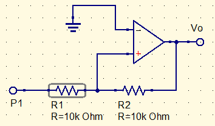
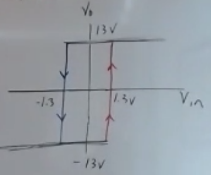
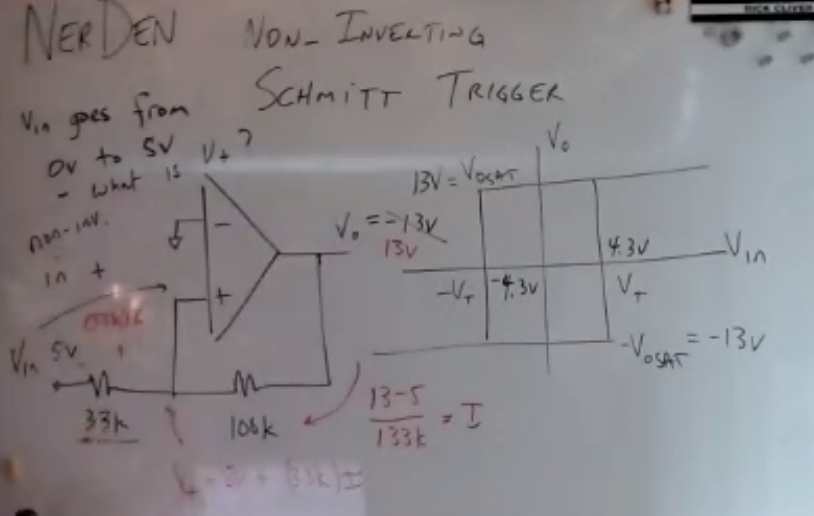

# Non-inverting Schmitt trigger

Amplifiers have negative feedback. The shmitt trigger has positive feedback

$R_i$ and $R_f$ are in the same spot, and may be called the same thing, but they are VERY different.

The trigger points are at ${-R_i\over R_f}V_{o_{sat}}$

In this instance:
$$
{10k\Omega\over100k\Omega}(13V)=-1.3V
$$
This means that any value under -1.3V will have an output value of -13V. Once it is saturated at 13V, it takes a voltage less than +1.3V to bring it back down. This is according to the graph seen below.

