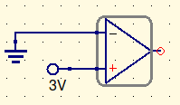

This is a comparator.

It is not to be confused with an amplifier.

Comparators don’t have feedback. As such, they work as such:
$$
V_o=A_{OL}(V_+-V_-)
$$

“Roughly 13, yeah! Thats almost 3,000,000!”

You can draw this as a graph, with 3 lines. One at the high saturation level, one at the low saturation level, and a vertical line connecting the two, determined by the grounded/static value.

If $V_i$ is on the minus, the +x portion of the graph is negative. If $V_i$ is on the plus, this is switched.

Alright. Lets make it more complex

These two images are equivalent.

When $I_B>>>0$, the $V_o = 0$. When $I_B=0$, $V_o=5V$

In the above example, $V_-= {15k\Omega(-15)\over 10k\Omega+15k\Omega} = 9V$

