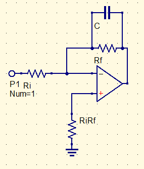
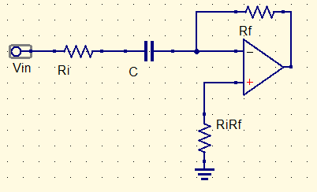

# Integrators and Differentiators

capacitors will be in very large pico, high frequency goes down to small pico
$$
{V_o\over V_{in}}={-Z_f\over R_i}\\
Z_f={R_f\over1+j\omega R_fC}\\
{V_o\over V_{in}}={{-R_f\over R_i}\over 1+j\omega R_fC}
$$
Integrators are, in essence, a low band pass filter. Differentiators are High-pass filter.

Cutoff is as follows:
$$
f_c={1\over2\pi R_f C}
$$
These are better than passive circuits in lower frequency ranges, mainly due to their smaller cost.

As frequency rises, the capacitor eats more of the feedback power, dropping the output power.

at low frequency, the resistor is the only one.  use ${-R_f\over R_i}$ for gain in these cases

At high frequencies, the capacitor is the only one. 

## Differentiator

RiRf does not exist, its a strait shot to ground

at low frequencies, the capacitor is the only one. At low frequencies the resistor is the only one

break frequency is 
$$
f_c={1\over 2\pi R_iC}
$$
