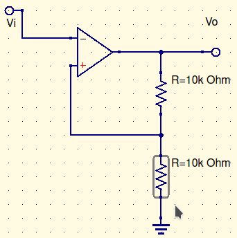

So, the problem with these, is the hair trigger. So, we’re gonna add positive feedback. There’s two ways of doing this:

This is the easy way. Its called an Inverting Schmitt Trigger. 

It looks like an amp, but the output goes to the plus. 

Given $V_o=13V$, $V_+=6.5V$. Given $V_o=-13V$, $V_+=-6.5V$. 

Changing $V_i$ from 0 doesn’t change anything, until hitting 6.5. This drops the output back to -13V. $V_i$ changing to -6.5 makes the $V_o$ +13 again.

It essentially adds a buffer between the triggers. 