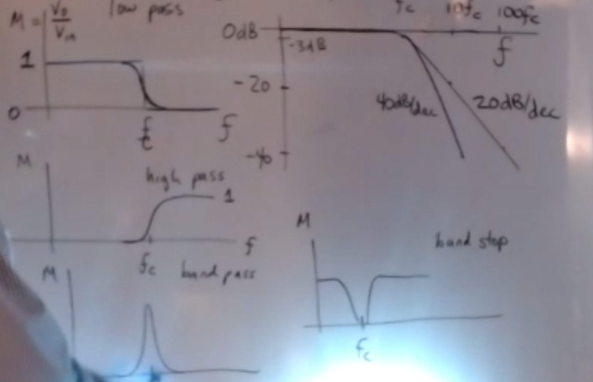

# Filters

low pass filters, high pass filters, band pass filters, and band stop filters

## Two pole low pass filter

$W_c=1n/s$

increasing the resistances by a factor of 1k and reducing the capacitor value by 1k will leave you with the same value.

To set the break frequency, divide the resistance and the capacitor by the break frequency