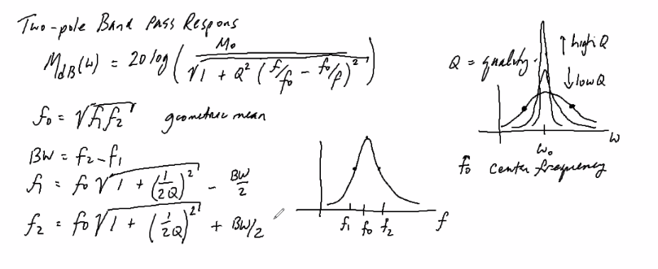
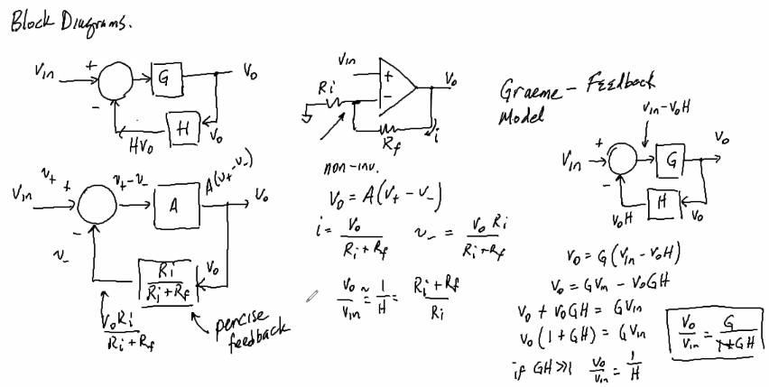
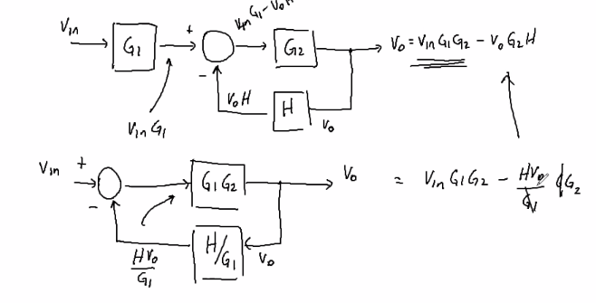

# Two Pole Band Pass Filter Response Equations:

$$
M_{dB}=20log({M_o\over\sqrt{1+Q^2({f\over f_0}-{f_0\over f})^2}})\\
f_0=\sqrt{f_1f_2}\\
where\\
f_1\ and\ f_2\ are\ cutoff\ frequencies\ and\ BW=f_2-f_1\\
and\\
M_o=max\ gain\\
f_{1,2}=f_0\sqrt{1+({1\over2Q})^2}\mp {BW\over2}\\
Q={reactive\over real}={\omega L\over R}=will\ be\ given\\
Q={f_0\over BW}
$$

## Example:

two pole band pass filter

center frequency of 800Hz

Q=20

Find 3dB Bandwidth
$$
Q={f_0\over BW}\\
BW={f_0\over Q}={800Hz\over20}\\
\overline{\underline{|BW=40Hz|}}
$$
find $f_1$
$$
f_{1}=f_0\sqrt{1+({1\over2Q})^2}-{BW\over2}\\
f_{1}=800Hz\sqrt{1+({1\over2(20)})^2}-{40Hz\over2}\\
$$
find $f_2$
$$
f_2=f_1+BW=780Hz+40Hz=820Hz
$$
Find response at frequency

`use chart given on mycourses`

can also use $M_{dB}$ equation above, but thats gross

