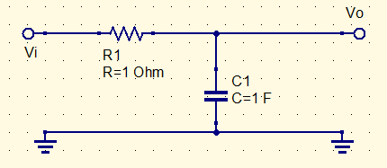

Start here.

Multiply the resistor by a nice value. Divide the capacitor by the same value.

Divide the capacitor by $2\pi f$

This sets the break frequency and makes the parts reasonable values

Another way to put it:
$$
{V_{out}\over V_{in}}={1\over1+j(2\pi fRC)}\\
|{V_{out}\over V_{in}}|={1\over \sqrt{1+({f\over f_C})^2}}
$$
adding another cap adds another $j(2\pi fRC)$

# Two pole filter

$$
{V_o\over V_i}={1\over\sqrt{1+({f\over f_C})^4}}
$$
($f\over f_C$) is to the 2n, where n is the number of poles (read as: the number of unique resistors)

With more poles, it becomes more complex, to the point where 5 or 6 pole filters aren't worth calculating

Adding additional poles is as simple as... look it up, becuase it sucks to come up with it manually

