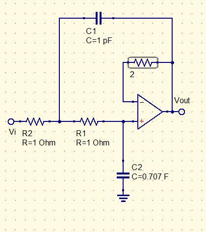

How to determine the order filter I want

We want a 7 pole filter with a 3dB cutoff frequency at 8kHz

What is $M_{dB}\ @f=12kHz$
$$
M_{dB}=20log({1\over\sqrt{1+({f\over f_{3dB}})^{2n}}})\\
M_{dB}=20log({1\over\sqrt{1+({12kHz\over 8kHz})^{14}}})=-24.67dB\\
$$
This was a low-pass filter

Now for a high pass filter
$$
M_{dB}=20log({1\over\sqrt{1+({ f_{3dB}\over f})^{2n}}})\\
M_{dB}=20log({1\over\sqrt{1+({12kHz\over 8kHz})^{14}}})=-24.67dB\\
$$
We can do this stupid cacluation thats rough on the head, or we can just use the graph

(image forthcoming)

$$
10^{M_{dB}\over10}-1=({f\over f_c})^{2n}
$$
Ok, cool, but how do you build it

Use two of these

There is a chart (incoming) that can be used to calculate cap values

