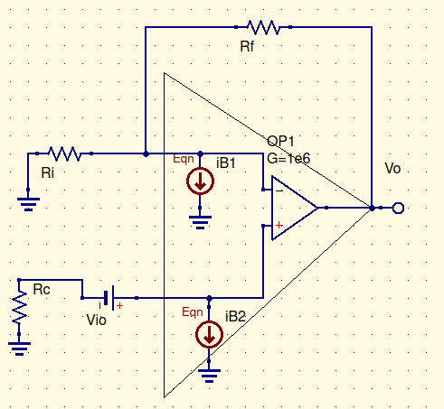

Think of an opamp as actually two nested op amps.

The inner is ideal. The outer… not.

on the inside of the + input, there is a battery ($V_{io}$) in series into the ideal. There is a current source going toward the circuit away from ground in parallel with both the negative and positive inputs

$$
V_o=V_{io}({1\over\beta})\\
V_o=I_{b+}({1\over\beta})\\
V_o=I_B(R_C{1\over\beta}-R_f)\\
R_C=R_i||R_f
$$
