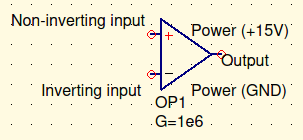

“I really enjoy torture-teaching people.” - Professor Cliver

This course is… Op-amps. And its about imperfections with op-amps.

For exams:

1 sheet per exam. (for the final (3rd test) you get 3 sheets)

# Ideal op-amp

Stands for operational amplifier.

Amplifies current, amplifies voltage. Can be used for signal conditioning.

What are some operations it can do?

- Sum
- subtract
- integrate
- differentiate

It has 5 pins. The diagram below is an ideal, and thus is missing the power and ground pins. There is text in their respective locations. The high and lower power pins are dependant upon the datasheet.

## Goals in life

- $V_+ =V_-$
- $I_+=I_-=0$

Ideal op-amps complete these goals. We will play with this a little, then we will move on to more complex cases.

The output is ultimately somewhere between the high power and the low power.

## Example diagram

***Results using an ideal op-amp***

$i_L={V_{in} \over R}={6V\over 2k\Omega}=3mA$

$v_o=7.2V$

^ These are found through nodal.

Nodal is about finding a voltage at any point in the circuit.

Nodal is currentIn = currentOut

Alternatively:
${V_{from} - V_{to} \over R}={V_{from} - V_{to} \over R}$

Next class, we’ll discuss why $i_L\ne{V_{in}\over R+R_L}$

