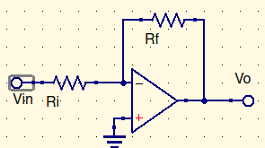

# Finite gain op-amps

$V_O=A(V_+-V_-)$, which implies that $V_+\ne V_-$

$$
0={V_--0\over R_i}+{V_--V_O\over R_f}\\
{V_O\over R_f}=V_-({1\over R_f}+{1\over R_i})\\.\\.\\.\\
{V_O \over V_{in}}={A\over 1+A\beta}\approx{1\over \beta}\\\therefore\\
{V_O\over V_{in}}=1+{R_f\over R_i}
$$

## Contrasted with infinite gain op-amps

$$
{V_{in}-0\over R_i}={V_O-V_{in}\over R_f}\\.\\.\\.\\
{V_O\over V_{in}}=1+{R_f\over R_i}
$$

You might be saying, well, whats the difference?

The finite op-amps have the $A$ values in there. We then assume $A$ is giant, so it goes back to the infinite.

# Inverting Amplifier

Givens:
$V_O=A(0-V_-)$
$$
0={V_--V_{in}\over R_i}+{V_-V_O\over R_f}\\
V_-({1\over R_f}+{1\over R_i})= V_{in}({1\over R_i})+V_O({R_f})\\.\\.\\.\\
V_-=V_{in}\alpha+V_O\beta\\.\\.\\.\\
{V_O\over V_{in}}=-{R_f\over R_{in}}
$$
