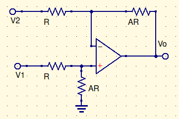

# Example 1

## Ideal

$$
{-v_i\over R_i}+{-V\over R_1}=0\\
V={-R_1v_i\over R_i}\\
\\[30pt]
{V\over R_2}+{V-v_o\over R_3}+{V\over R_1}=0\\
{-R_1v_i\over R_2R_1}+{-R_1v_i\over R_3R_1}+{v_i\over R_i}={v_o\over R_3}\\
{v_o\over v_i}={R_1\over R_i}+{R_3\over R_i}(1+{R_1\over R_2})=A
$$

# Differential Amplifier

$$
{V-V_1\over R}+{V\over AR}=0\\
{AV\over AR}+{V\over AR}={V_1\over R}\\
{V_1A\over A+1}=V\\[25pt]
{V-V_2\over \cancel R1}+{V-V_o\over A\cancel R}=0\\
V-V_2+{V_1\over 1+A}={V_o\over A}\\
{V_1\cancel{(A+1)}\over \cancel{(A+1)}}-V_2={V_o\over A}\\
\underline{\overline{|V_o=A(V_1-V_2)|}}
$$

# Finite Gain

$$
A_{CL}={1+{R_f\over R_i}\over 1+{1\over A\beta}}\hspace{15pt}\beta={R_i\over R_i+R_f}\\
$$

$$
A_{CL}={1+{R_f\over R_i}\over 1+{1\over A\beta}}\hspace{15pt}\beta={R_i\over R_i+R_f}\\
$$
