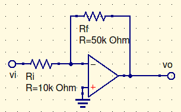
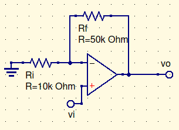

# ***Skyler MacDougall***

## ***Homework 1: Due 1/20/2020***

### Chapter 2

1. Consider the circuit of Figure P2-1 with $R_i=10k\Omega$ and $R_f=50k\Omega$

    

    1. Determine the closed-loop voltage gain.

    $$
    A_{CL}={V_o\over V_i}={R_f\over R_i}=-5
    $$

    2. Determine the input impedance of the circuit.

    $$
    r_i=R_i=10k\Omega
    $$

    3. Determine the ideal output impedance of the circuit.

    $$
    r_o=0\Omega
    $$

    4. Determine the peak input voltage $v_i$ (peak) for which linear operation is possible.

    $$
    V_{ipk}={V_{sat}\over |A_{CL}|}=({13\over 5})or(2{3\over 5})
    $$

    5. Determine the output voltage for each of the following values for the following input voltages.

    $$
    V_o=A_{CL}v_i
    $$

    | $v_i$ (V) | $v_o$ (V) |
    | --------- | --------- |
    | 0         | 0         |
    | -1        | 5         |
    | 2         | -10       |
    | -3        | 15        |
    | 4         | -20       |

3. Consider the circuit of Figure P2-3 with $R_i=10k\Omega$ and $R_f=50k\Omega$

1. Determine the closed-loop voltage gain.

$$
A_{CL}={V_o\over V_i}={R_f+R_i\over R_i}={6\over 5}
$$

2. Determine the input impedance of the circuit.

$$
r_i=R_i=10k\Omega
$$

3. Determine the ideal output impedance of the circuit.

$$
r_o=0\Omega
$$

4. Determine the peak input voltage $v_i$ (peak) for which linear operation is possible.

$$
V_{ipk}={V_{sat}\over |A_{CL}|}=({13(5)\over 6})or(10{5\over 6})
$$

5. Determine the output voltage for each of the following values for the following input voltages.

$$
V_o=A_{CL}v_i
$$

| $v_i$ (V) | $v_o$ (V)    |
| --------- | ------------ |
| 0         | 0            |
| -1        | $-6\over5$   |
| 2         | $12\over5$   |
| -3        | $-18\over 5$ |
| 4         | $24\over 5$  |

5. For the circuit of Problem 2-1 with $v_i=-2V$, assume an external load of $R_L =2k\Omega$ is connected to the output. Determine the total op-amp output current.

$$
A{CL}=-10\\
v_i=2V\\
v_0=-20V\\
{V\over R}=I\\
{20V\over 2k\Omega}=I={1\over100}A=10mA
$$