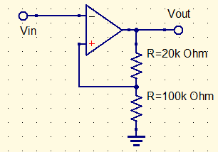
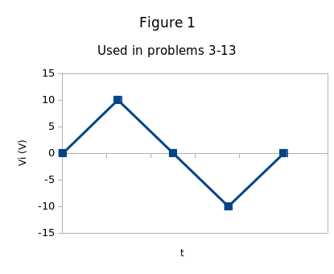

# Skyler MacDougall

##  Homework 10: Due 3/30/2020

15. Consider the circuit below:
    
    1. Calculate the threshold voltage.
    2. Sketch the input-output characteristic curve.
    3. Sketch the output if the following waveform is connected to the input.
        

17. Consider the circuit in question 15 with the following modifications:
    $$
    R_1=\cancel{20k\Omega}27k\Omega\\
    R_2=\cancel{100k\Omega}68k\Omega
    $$

    1. Calculate the threshold voltage.
    2. Sketch the input-output characteristic curve.
    3. Sketch the output if the following waveform is connected to the input.

25. 

29. 

31. 

35. 

