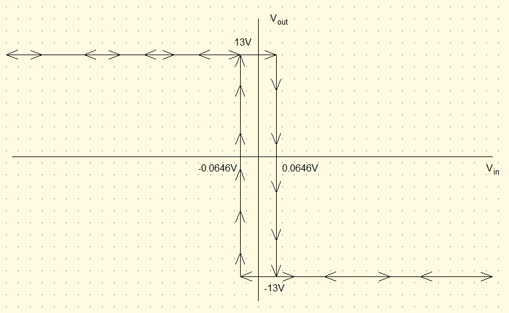
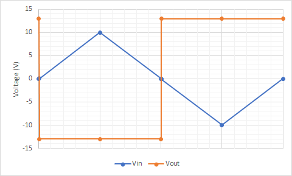
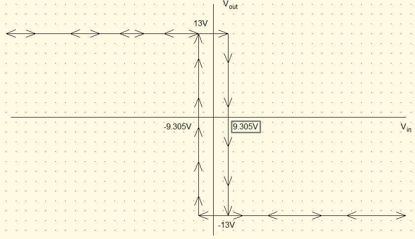
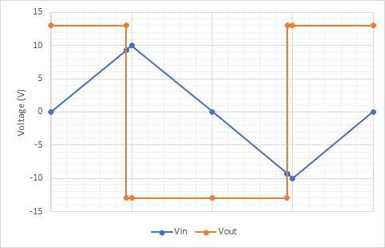
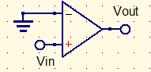
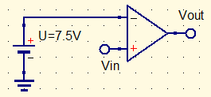
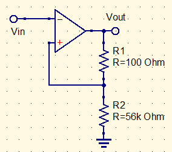

# Skyler MacDougall

##  Homework 10: Due 3/30/2020

15. Consider the circuit below, where the $100k\Omega$ resistor is a $100\Omega$:
    
    
    1. Calculate the threshold voltage.
        $$
        V_T=V_{sat}*{R_2\over R_1+R_2}=\pm13V*{100\Omega\over 20.1k\Omega}\\
        V_T=\pm0.0646V
        $$
        
    
    2. Sketch the input-output characteristic curve.
        
    
    3. Sketch the output if the following waveform is connected to the input.
        

17. Consider the circuit in question 15 with the following modifications:
    $$
    R_1=\cancel{20k\Omega}27k\Omega\\
    R_2=\cancel{100\Omega}68k\Omega
    $$

    1. Calculate the threshold voltage.
        $$
        V_T=V_{sat}*{R_2\over R_1+R_2}=\pm13V*{68k\Omega\over 68k\Omega+27k\Omega}\\
        V_T=\pm9.305V
        $$
        
    
    2. Sketch the input-output characteristic curve.
        
    
    3. Sketch the output if the following waveform is connected to the input.

25. Using a general-purpose op-amp, design an open-loop zero crossing detector based on the following logic:
    $$
    V_o\approx13V\ for\ v_i>0\\
    V_o\approx-13V\ for\ v_i<0\\
    $$
    

29. An open-loop comparator is desired to provide the following logic:
    $$
    V_o\approx13V\ for\ v_i>7.5V\\
    V_o\approx-13V\ for\ v_i<7.5V\\
    $$

31. An inverting Schmitt trigger circuit is designed for use as a zero-crossing detector. Based on saturation voltages of $\pm13V$, the hysteresis transition voltages desired are about $\pm25mV$. Determine an acceptable design using 5% resistors.

35. A circuit is to be designed to convert a 6V sine wave to square wave oscillating between -13V and 13V. A control is to be provided for possible delay adjustment as follows:

    1. At one extreme setting , the output square wave will be $180^\circ$ out of phase with the sine wave.
    2. At the other extreme, the output wave will undergo its transition at positive and negative peaks of the sine wave. 

    Specify the value of any fixed resistance and the range of any variable resistance used.

