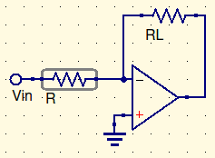
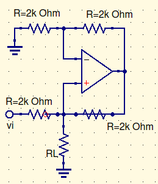
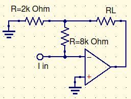
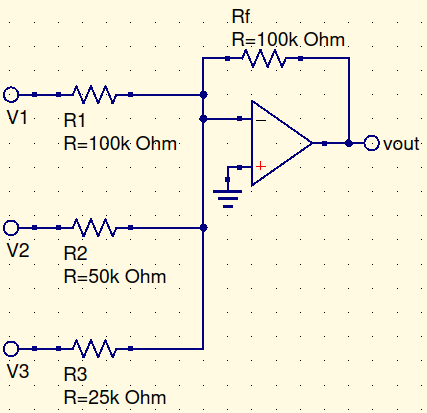
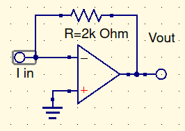
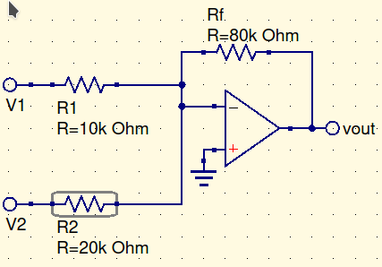
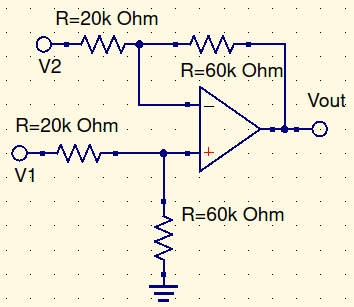

# Skyler MacDougall

##  Homework 2: Due 1/29/2020

7. Consider the circuit below, with $R=1k\Omega$.

    

    1. Determine the transconductance.
        $$
        g={1\over R}={1\over 1k\Omega}=100\mu S
        $$

    2. For $V_1=10V$ determine $i_L$ for $R_L=500\Omega$.
        $$
        i_L=i_i={V_i\over R}={10V\over1k\Omega}\\
        i_L=1mA
        $$

    3. Repeat (2.) for $R_L=1k\Omega$.

        $i_i=i_L \therefore i_L = 1mA$ 

    4. Determine the maximum value for $R_L$ for linear operation.
        $$
        i_iR_L<V_{sat};i_i=1mA;V_{sat}=13V\\
        R_L=1.3k\Omega
        $$

9. Consider the circuit below.

    

    1. Determine the transconductance.
        $$
        g={1\over R}={1\over 2k\Omega}=500\mu S
        $$

    2. For $V_i=6V$ and $R_L=1.2k\Omega$, determine $i_L$.
        $$
        i_L={V_i\over R}={6V\over 2k\Omega}\\
        i_L=3mA
        $$

    3. Determine the maximum value for $R_L$ for linear operation.
        $$
        R_Li_L<{V_{sat}\over2}
        $$
        

9. Consider the circuit below.

    

    1. Determine the value of $\beta$.
        $$
        \beta=1+{R_2\over R_1}=1+{8k\Omega\over2k\Omega}\\
        \beta=5
        $$
        
    2. For $i_i=0.6mA$ and $R_L=1k\Omega$, verify linear operation.
        $$
        (R_2+\beta R_L)(i_i)<V_{sat}\\
        (8k\Omega+5(1k\Omega))(0.6mA)<13V\\
        13\cancel{k}\Omega*0.6\cancel{m}A<13V \\
        7.8V<13V
        $$

    3. Determine $i_L$ for the conditions in (2.)
        $$
        i_L=\beta i_i\\
        i_L=3mA
        $$
        

15. Consider the circuit below.

    

    1. Write an equation for $V_O$ in terms of the three input voltages.
        $$
        V_O=-(V_1+2V_2+4V_3)
        $$

    2. Determine $V_O$ given $V_1=10V;V_2=3V;V_3=-7V$.
        $$
        V_O=-(10V+2(3V)+4(-7V))=28V-16V\\
        V_O=12V
        $$

    3. Determine $V_O$ given $V_1=8V;V_2=-4V;V_3=5V$.
        $$
        V_O=-(\cancel{8V}+\cancel{2(4V)}+4(5V))\\
        V_O=-20V
        $$
        

35. Design a current controlled voltage source to have a transresistance of $2k\Omega$. Then determine the peak value $i_{i_{pk}}$ permitted for the input current for linear operation.

$$
V_O=-Ri_i<V_{sat}\\
2k\Omega*i_i<13V\\
i_i=6.5mA
$$

39. Design a linear combination circuit to combine two signals as follows:

$$
v_o=-4v_1-8v_2
$$
Using the following specifications:

1. $R_{in}\ge10k\Omega$ at both inputs
2. All resistance values $\le100k\Omega$

41. Design a balanced closed-loop differential circuit to combine two signals as follows:
    $$
    v_o=3(v_1-v_2)
    $$
    Use resistances in the range of $10k\Omega-100k\Omega$.

