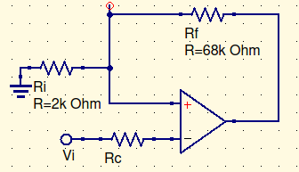
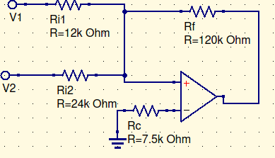

# Skyler MacDougall

##  Homework 4: Due 2/10/2020

9. Given the circuit below:
    
    
    1. Determine the noise gain ($K_n$) for the circuit.
        $$
        K_n={1\over \beta};\ \beta={R_i\over R_i+R_f}\\
        K_n={68k\Omega+2k\Omega\over2k\Omega}\\
        \overline{\underline{|K_n=35|}}
        $$
        
    2. Use the result to calculate the exact signal gain at DC and low frequencies if $A_o=10^5$.
        $$
        K_n={1\over \beta};\ \beta={1\over 35}\\
        A_{CL}={A_o\over1+A_o\beta}={10^5\over1+(10^5)({1\over35})}\\
        \overline{\underline{|A_{CL}=3.9998\approx4|}}
        $$
        

11. Given the circuit below:
     
    
    1. Determine the noise gain ($K_n$) for the circuit.
        $$
        K_n={1\over\beta};\ \beta={R_i\over R_i+R_f};\ R_i=12k\Omega||24k\Omega=8k\Omega\\
        K_n={8k\Omega+120k\Omega\over8k\Omega}\\
        \overline{\underline{|K_n=16|}}
        $$
        
    2. Use the result to calculate the exact gain factors for the two signals if $A_o=5\times 10^4$.
        $$
        K_n={1\over \beta};\ \beta={1\over 16}\\
        A_{CL}={A_o\over1+A_o\beta}={5\times10^4\over1+(5\times10^4)({1\over16})}\\
        \overline{\underline{|A_{CL}=15.9949\approx16|}}
        $$
        

13. For the circuit shown in problem 9, assume the following:
    $$
    V_{io}=1.2mV\\
    I_b=60nA\\
    I_{io}=8nA
    $$

    1. Determine the magnitude of the output DC voltage $|V_{o1}|$ produced by the input offset voltage.
        $$
        V_{o1}=V_{io}(\alpha);\ \alpha={R_f\over R_i+R_f}={34\over35}\\
        V_{o1}=1.2mV({34\over35})\\
        \overline{\underline{|V_{o1}=1.6mV|}}
        $$
        
    2. With $R_c=0$ determine the magnitude of the output dc voltage $|V_{o2}|$ produced by the input bias currents.
        $$
        V_{o2}=R_c(\alpha)i_b^+-R_f(I_b^2);\ R_c=0\\
        i_{io}=i_b^+-i_b^-;\ i_b={i_b^++i_b^-\over2}\\
        8nA=i_b^+-i_b^-;\ 120nA=i_b^++i_b^-\\
        i_b^+=64nA;\ i_b^-=56nA\\[16pt]
        V_{o2}=0-68k\Omega(56nA)\\
        \overline{\underline{|V_{o2}=-3.808mV|}}
        $$
        
    3. Determine the optimum value of $R_c$.
        $$
        R_{c_{ideal}}=2k\Omega||68k\Omega\\
        \overline{\underline{|R_{c_{ideal}}=1.94k\Omega|}}
        $$
        
    4. Given your new value for $R_c$, find $|V_{o2}|$.
        $$
        V_{o2}=R_c(\alpha)i_b^+-R_f(I_b^2);\ R_c=0;\ i_b^+=64nA;\ i_b^-=56nA\\
        V_{o2}=1.94k\Omega({34\over35})(64nA)-3.808mV\\
        \overline{\underline{|V_{o2}=-3.688V|}}
        $$
        

25. An op-amp is used at DC and very low frequencies. A closed loop gain of 200 is required. Specifications indicate that the error due to finite open loop gain cannot exceed 0.1%. Determine the minimum value of the DC open loop gain required.

I am unsure how to do this problem. It feels like there is not enough information do this problem, but I can’t seem to wrap my head around it.

27. Assume the design of problem 25, with the following additional parameters:
    $$
    DC\ output\ due\ to\ input\ offset\ voltage \le100mV\\
    DC\ output\ due\ to\ input\ offset\ current \le5mV\\
    $$

    1. Determine the maximum value of input offset voltage allowed for the op-amp.
    2. When an op-amp is selected to meet the requirements for the above, assume that $I_{io}=12\mu A$. Calculate the maximum value of $R_f$ permitted, assuming that a compensating resistors will be used.

Due to this question being directly related to question 25, I cannot do this question either.