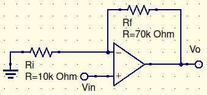
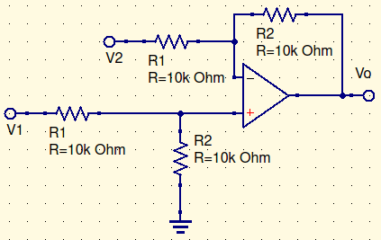
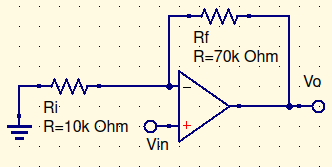
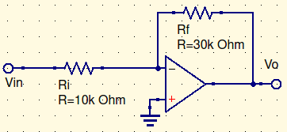

# Skyler MacDougall

##  Homework 6: Due 2/24/2020

5. Calculate the rise time $T_{CL}$ associated with the following gain values:
    1. $A_{CL}=500$
        $$
        A_{CL}={V_o\over V_i}=1-e^{-2\pi B_{CL}t}\\
        A_{CL}-1=e^{-2\pi B_{CL}t}\\
        ln(A_{CL}-1)={-2\pi B_{CL}t}\\
        {ln(A_{CL}-1)\over-2\pi B_{CL}}=t;\ B_{CL} =4kHz\\
        {ln(499)\over-2\pi (4kHz)}=t\\
        \overline{\underline{|t=247.2\mu s|}}
        $$
    
    2. $A_{CL}=50$
        $$
        {ln(A_{CL}-1)\over-2\pi B_{CL}}=t;\ B_{CL} =40kHz\\
        {ln(49)\over-2\pi (40kHz)}=t\\
        \overline{\underline{|t=15.5\mu s|}}
        $$
    
    3. $A_{CL}=5$
        $$
        {ln(A_{CL}-1)\over-2\pi B_{CL}}=t;\ B_{CL} =400kHz\\
        {ln(4)\over-2\pi (400kHz)}=t\\
        \overline{\underline{|t=551.6ns|}}
        $$
    
    4. $A_{CL}=1$
        $$
        {ln(A_{CL}-1)\over-2\pi B_{CL}}=t;\ B_{CL} =2MHz\\
        {ln(0)\over-2\pi (2MHz)}=t\\ln(0)=-\infin \\ \therefore \\
        \overline{\underline{|t=unknown|}}
        $$

9. Consider the following circuit:
    
    
    
    If the unity-gain frequency of the op amp is 1.6MHz, determine the closed loop 3-dB bandwidth.
    $$
    A_{CL}=1+\frac{R_i}{R_f}=1+\frac{10k\Omega}{70k\Omega}=1.1428\\
    B_{CL}=\frac{B}{A_{CL}}=\frac{1.6MHz}{1.1428}\\
    \overline{\underline{|B_{CL}=1.12MHz|}}
    $$

13. Calculate the rise time $T_{CL}$ for the circuit stated above.
    $$
    {ln(A_{CL}-1)\over-2\pi B_{CL}}=t;\ B_{CL} =1.12MHz\\
    {ln(0.1418)\over-2\pi (1.12MHz)}=t\\
    \overline{\underline{|t=276.5ns|}}
    $$
    

19. Consider the circuit below:
    
    
    
    If the unity-gain frequency of the op-amp is 1MHz, determine the closed-loop 3-dB bandwidth.
    $$
    B_{CL}=\frac{B}{A_{CL}}\\
    A_{CL}=\frac{R_2}{R_1}=\frac{10k\Omega}{10k\Omega}=1\\
    B_{CL}=\frac{1MHz}{1}\\
    \overline{\underline{|B_{CL}=1MHz|}}
    $$

21. Consider the following circuit:

    

    Assume that the op-amp slew rate is $0.6V/\mu s$. Calculate the rise time $T_{SR}$ due to the slew rate when the input is a pulse that changes from zero to the following values:

    1. 10mV
        $$
        T_{SR}=\frac{V_o}{S}\\
        T_{SR}=\frac{V_iA_{CL}}{0.6V/\mu s}\\
        A_{CL}=1+\frac{R_i}{R_f}=1+\frac{10k\Omega}{70k\Omega}\\
        T_{SR}=\frac{(10mV)(1.1428)}{0.6V/\mu s}\\
        \overline{\underline{|T_{SR}=23.8ns|}}
        $$

    2. 0.1V
        $$
        T_{SR}=\frac{V_iA_{CL}}{0.6V/\mu s}\\
        T_{SR}=\frac{(100mV)(1.1428)}{0.6V/\mu s}\\
        \overline{\underline{|T_{SR}=238ns|}}
        $$

    3. 1V
        $$
        T_{SR}=\frac{V_iA_{CL}}{0.6V/\mu s}\\
        T_{SR}=\frac{(1V)(1.1428)}{0.6V/\mu s}\\
        \overline{\underline{|T_{SR}=2.38\mu s|}}
        $$

23. Consider the following circuit:
    

    Assume that the op-amp slew rate is $0.5V/\mu s$. Calculate the rise time $T_{SR}$ due to the slew rate when the input is a pulse that changes from zero to each of the following values:

    1. 0.2V
        $$
        T_{SR}=\frac{V_o}{S}\\
        T_{SR}=\frac{V_iA_{CL}}{0.5V/\mu s}\\
        A_{CL}=-\frac{R_f}{R_i}=\frac{-3}{1}=-3\\
        T_{SR}=\frac{(0.2V)(-3)}{0.5V/\mu s}\\
        \overline{\underline{|T_{SR}=1.2\mu s|}}
        $$
    
    2. 1V
        $$
        T_{SR}=\frac{V_iA_{CL}}{0.5V/\mu s}\\
        T_{SR}=\frac{(1V)(-3)}{0.5V/\mu s}\\
        \overline{\underline{|T_{SR}=6\mu s|}}
        $$
    
    3. 3V
        $$
        T_{SR}=\frac{V_iA_{CL}}{0.5V/\mu s}\\
        T_{SR}=\frac{(3V)(-3)}{0.5V/\mu s}\\
        \overline{\underline{|T_{SR}=18\mu s|}}
        $$