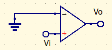
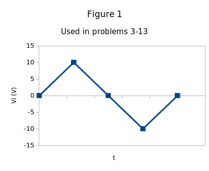

# Skyler MacDougall

##  Homework 9: Due 3/25/2020

3. The waveform shown below is applied to the input to the circuit below. Sketch the output:

    

    

7. The waveform given above is applied as the input to the following circuit. Sketch the output.

    

9. 

    1. Sketch the input-output characteristic curve of the circuit of the figure above. 

        asdf

    2. If the waveform below is applied, sketch the output.

        

11. Apply the figure 2’s waveform to question 9. Sketch the output.

13. Figure 2’s waveform is applied to the following circuit, where the opamp is a LM311, pin 8 is $+15V$, pin 4 is $-15V$, and pin 1 is grounded. Sketch the output.

    

