# Skyler MacDougall

## Exam 2

## Due April 22^nd^ at 8pm

1. If $V_{IN1}=6V,\ V_{IN2}=2V, V_{O(SAT)}=\pm13V, R_L=5k\Omega$ in the following image, determine the output voltage $V_O$ of the comparitor.

    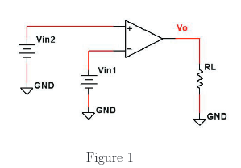
    $$
    V_{IN1}>V_{IN2};\ V_{IN1}=inverting\ input\\
    \therefore\\
    \underline{\overline{|V_O=-13V=(a)|}}
    $$
    
2. If $V_{IN1}=6V, V_{IN2}=1V, V_{O(SAT)}=\pm13V, R_L=4k\Omega$, determine the output current $I_L$ (the current through $R_L$) of the comparator. (Using the comparator noted in question 1)
    $$
    VV_{IN1}>V_{IN2};\ V_{IN1}=inverting\ input\\
    \therefore\\
    V_O=-13V\\
    I_L={V_O\over R_L}={-13V\over4k\Omega}\\
    \overline{\underline{|I_L=-3.25mA=(d)|}}
    $$
    
3. For a non-inverting amplifier with $R_f=9k\Omega, R_i=5k\Omega$ and the total RMS noise level referred to the input is $7\mu V$, select the noise level. 
    $$
    A=1+{R_f\over R_i}=1+{9k\Omega\over 5k\Omega}=2.8\\
    V_o=V_i*A=V_i=7\mu V*2.8\\
    \overline{\underline{|V_{o\ Noise}=19.6\mu V=(b)|}}
    $$
    
4. An amplifier has a common mode gain of $30dB$ and a differential gain of $110dB$. What is the common mode rejection ratio?
    $$
    CMRR=20log({A_d\over |A_{cm}|})\\
    CMRR=20log({11\cancel{0dB}\over |3\cancel{0dB}|})\\
    CMMR=11.28dB
    $$
    :woman_shrugging: (c)

5. An op-amp has a slew-rate of $5{V\over \mu s}$ and is configured as a non-inverting amplifier, with $R_f=9.6k\Omega, R_i=4.2k\Omega$. If an $8.00mV$ peak sine wave is applied to the non-inverting input, determine the slew-rate limiting frequency.
    $$
    f_{sr}={S\over2\pi V_o};\ V_o=V_i*(1+{R_f\over R_i})\\
    f_{sr}={S\over2\pi V_i*(1+{R_f\over R_i})}\\
    f_{sr}={5{\cancel{V}\over\mu s}\over2*\pi *8m\cancel{V}*(1+{9.6\cancel {k\Omega} \over 4.2 \cancel {k\Omega}})}\\
    f_{sr}={5\over2*\pi *0.0008*3.28}MHz\\
    \overline{\underline{|f_{sr}=30.27MHz\approx30.3MHz=(a)|}}
    $$
    
6. An op-amp has a unity gain frequency of $4MHz$ and is configured as a non-inverting amplifier with $R_f=10.0k\Omega, R_i=4.4k\Omega$. Calculate the rise time ($t_{CL}$) associated with the amplifier.
    $$
    T_{sr}={0.35\over BW};\ BW={B\over k_n};\ k_n=1+{R_f\over R_i}\\
    T_{sr}={0.35\over {B\over1+{R_f\over R_i}}}\\
    T_{sr}={0.35\over {4MHz\over1+{10.0\cancel{k\Omega}\over 4.4\cancel{k\Omega}}}}\\
    T_{sr}={0.35\over {4\over3.\overline{27}}}\mu s\\
    \underline{\overline{|T_{sr}=286.\overline{36}ns=(d)|}}
    $$

7. Sketch the input characteristic curve given the below image and:
    $$
    R_1=8.1k\Omega\\
    R_2=3.1k\Omega\\
    V_{O(STAT)}=\pm13V
    $$
    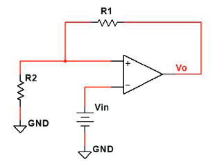
    

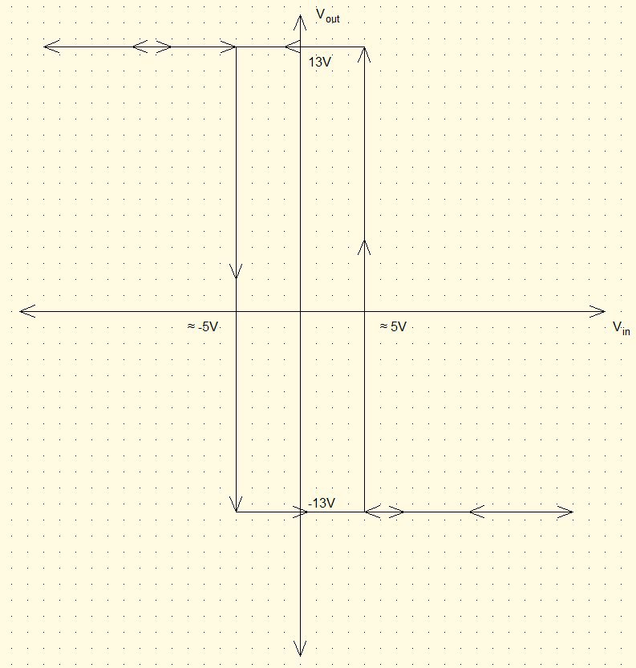
    
8. Sketch the output curve given the input curve shown below and the following:
    $$
    R_1=8.2k\Omega\\
    R_2=4.6k\Omega\\
    V_{O(SAT)}=\pm14V
    $$
    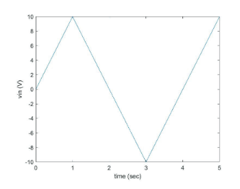
    
    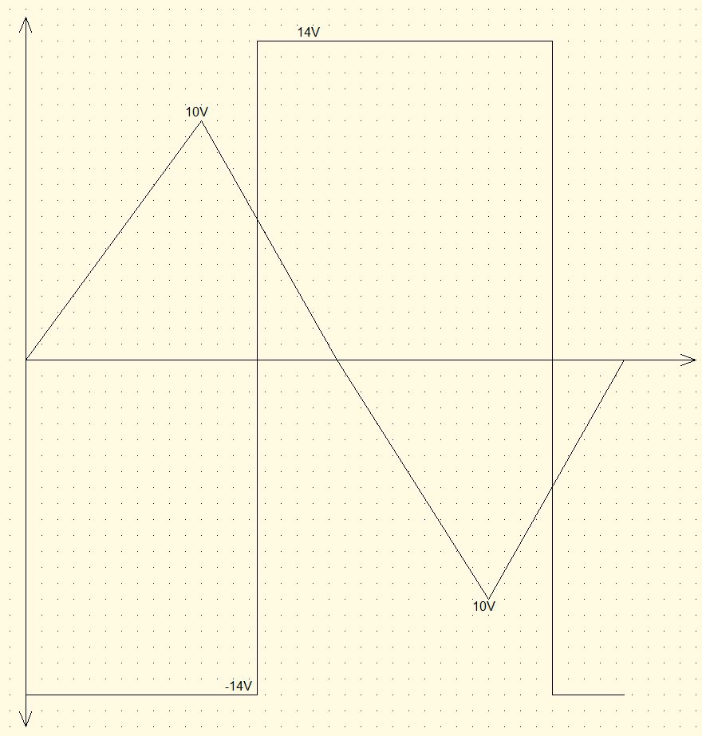
    
9. Sketch the input-output characteristic curve given the image below and the following:
    $$
    R_1=9.4k\Omega\\
    R_2=3.3k\Omega\\
    V_{O(SAT)}=\pm13V
    $$
    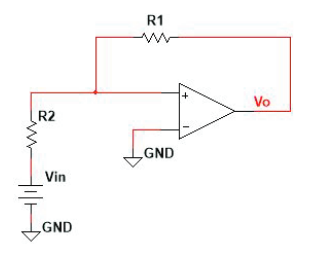
    
    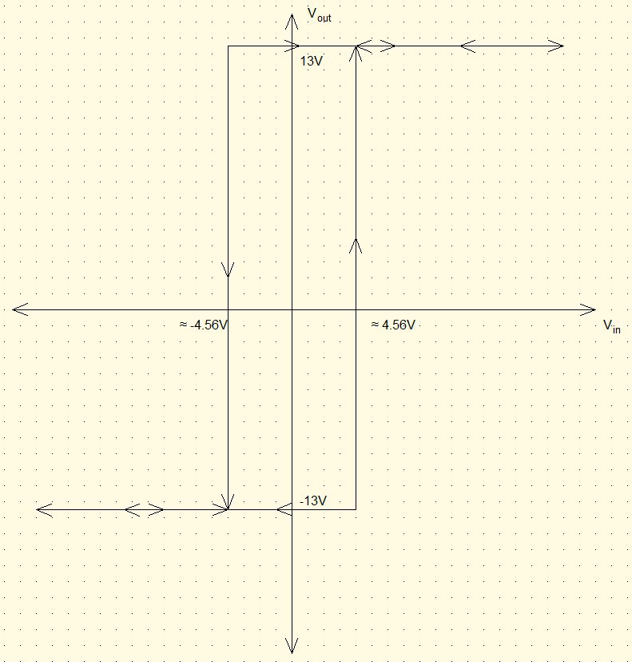
    
10. Sketch the output curve given the input curve below and the following:
    $$
    R_1=9.0k\Omega\\
    R_2=4.9k\Omega\\
    V_{O(SAT)}=\pm13V
    $$
    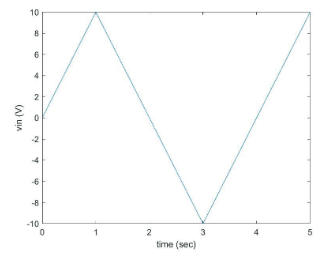
    
    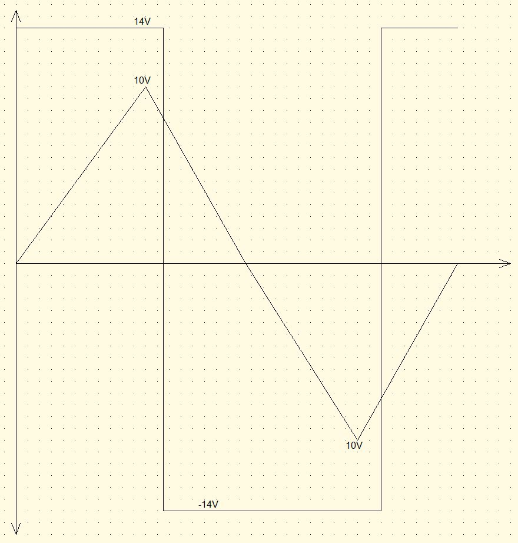
    
11. Sketch the input-output characteristic curve given the below image and the following:
    $$
    R_1=9.6k\Omega\\
    R_2=3.9k\Omega\\
    V_{O(SAT)}=\pm13V
    $$
    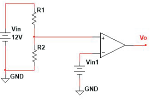
    
    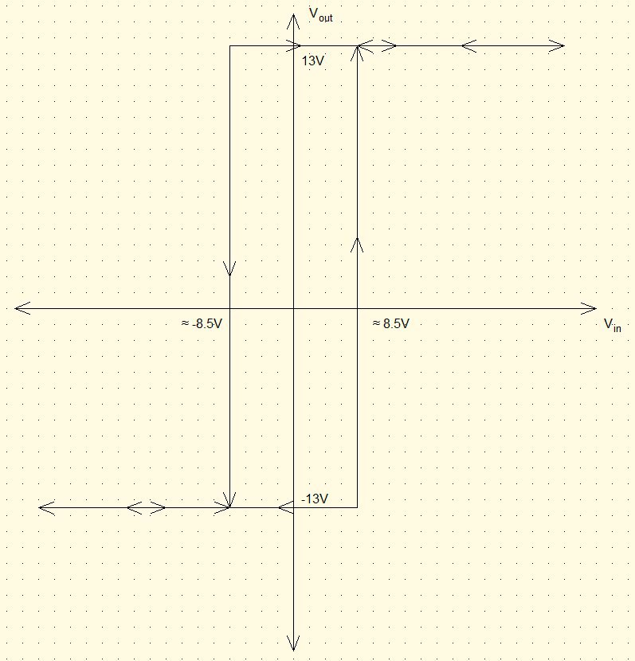
    
12. Sketch the output curve given the input ($V_{in1}$) curve and the following:
    $$
    R_1=9.7k\Omega\\
    R_2=3.2k\Omega\\
    V_{O(SAT)}=\pm12V
    $$
    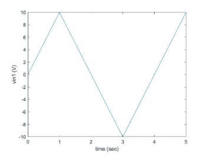
    
    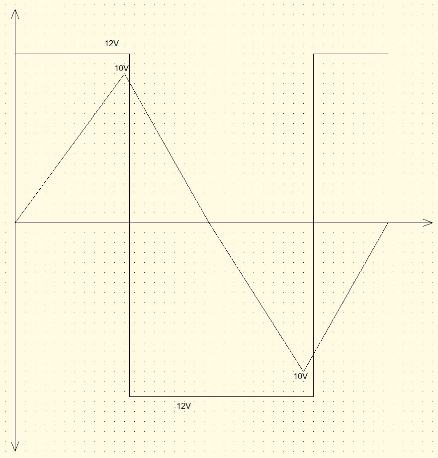
    
13. What has been the most confusing point so far in this class?

Nothing much in particular, although I may have missed the last couple problems on this exam due to misunderstanding how triggers work.