# EEET-221 Final Exam

## Skyler MacDougall

1. If $I_{b+}=214nA\ and\ I_{b-}=188nA$, determine $I_{os}$.

    1.  ==26nA==
    2.  214nA
    3.  402nA
    4.  201.00nA

2. If $V_{in1}=7V.V_{in2}=1V, V_{O_{SAT}}=\pm15V,R_L=5k\Omega$ in figure 1, determine the output current $I_L$ of the comparitor (the current through $R_L$).

    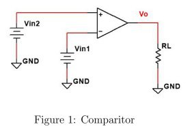

    1.  1.20mA
    2.  0.80mA
    3.  ==-3.00mA==
    4.  3.00mA

3. An op-amp has a slew rate of $4{V\over\mu s}$ and is convigured as a non-inverting amplifier, where $R_f=9.9k\Omega,R_i=3.2k\Omega$. If a $8.00mV$ peak sine wave is applied to the non-inverting input, determine the slew rate limiting frequency.

    1.  ==19.4MHz==
    2.  79.6MHz
    3.  122.1MHz
    4.  246.2MHz

4. An op-amp has a unity gain frequency of 4MHz and is configured as a non-inverting amplifier where $R_f=9.8k\Omega,R_i=3.2k\Omega$. Calculate the rise time ($t_{CL}$) associated with the amplifier.

    1.  4.00ns
    2.  1015.63ns
    3.  0.98ns
    4.  ==355.47ns==

5. Find the voltage at the inverting input if:
    $$
    V_{in}=1.06V\\
    R_i=62k\Omega\\
    R_f=18k\Omega\\
    R_L=134k\Omega
    $$
    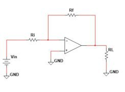
    $$
    V_-=V_+\\
    \therefore\\
    V_-=0V
    $$

6. Find the current in $R_f$ if, using the diagram in question 5:
    $$
    V_{in}=0.20V\\
    R_i=2k\Omega\\
    R_f=5k\Omega\\
    R_L=133k\Omega
    $$

    $$
    V_o=(1+{R_f\over R_i})V_i\\
    V_0=700mV\\
    I_f={0.2V-0.7V\over5k\Omega}\\
    \overline{\underline{|I_f=-100mA|}}
    $$

7. Find the voltage at the inverting input, given the diagram in question 5 and:
    $$
    V_{in}=0.22V\\
    R_i=40k\Omega\\
    R_f=12k\Omega\\
    R_L=141k\Omega
    $$

    $$
    V_-=V_+\\
    \overline{\underline{|V_-=0.22V|}}
    $$

8. FInd the noise gain given the diagram in question 5 and:
    $$
    V_{in}=0.54V\\
    R_i=14k\Omega\\
    R_f=17k\Omega\\
    R_L=151k\Omega
    $$

    $$
    k_n=1+{R_f\over R_i}=1+{17 \cancel {k\Omega} \over 14 \cancel {k\Omega}}\\
    \overline{\underline{|k_n=2.2143|}}
    $$

9. Find the current in $R_L$ given the diagram in question 5 and:
    $$
    V_{in}=0.58V\\
    R_i=65k\Omega\\
    R_f=21k\Omega\\
    R_L=139k\Omega
    $$

    $$
    V_o=(1+{R_f\over R_i})V_i=(1+{21k\Omega\over65k\Omega})0.58V\\
    V_o=767.38mV\\
    I_L={V_o\over R_L}={767.38mV\over139k\Omega}\\
    \overline{\underline{|I_L=5.52\mu A|}}
    $$

10. Find $V_L$ given:
    $$
    V_{io}=4mV\\
    R_i=2k\Omega\\
    R_c=2k\Omega\\
    R_f=153k\Omega
    $$
    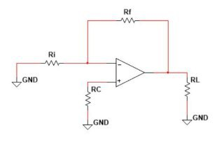
    $$
    V_L=V_{io}(1+{R_f\over R_i})=4mV(1+{153k\Omega\over 2k\Omega})\\
    \overline{\underline{|V_L=310mV|}}
    $$

11. Find the closed loop 3dB bandwidth for a non-inverting amplifier if given the following:
    $$
    B=3MHz\\
    R_i=2kHz\\
    R_f=177k\Omega
    $$

    $$
    BW={B\over k_n}={3MHz\over 1+{R_f\over R_i}}={3MHz\over 1+{177k\Omega\over 2k\Omega}}={3MHz\over 89.5}\\
    \overline{\underline{|BW=33.52kHz|}}
    $$

12. Sketch the input-output characteristic curve, given:
    $$
    R_1=9.3k\Omega\\
    R_2=3.9k\Omega\\
    V_{O_{SAT}}=\pm12V
    $$
    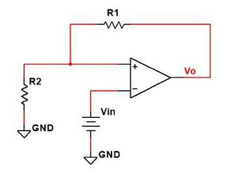
    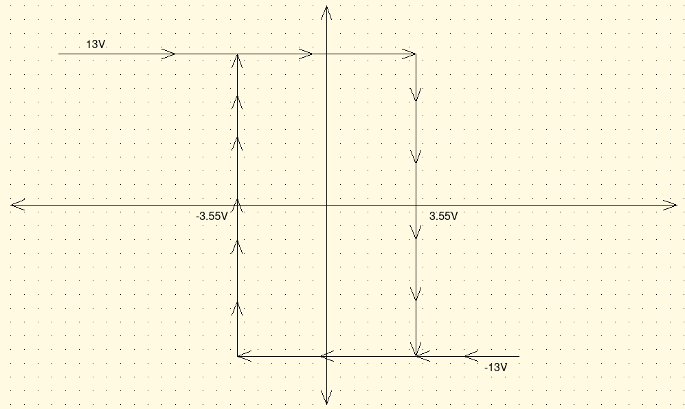

13. Sketch the output curve given the diagram in question 12 and:
    $$
    R_1=9.5k\Omega\\
    R_2=3.5k\Omega\\
    V_{O_{SAT}}=\pm13V
    $$
    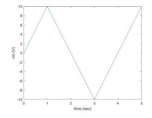
    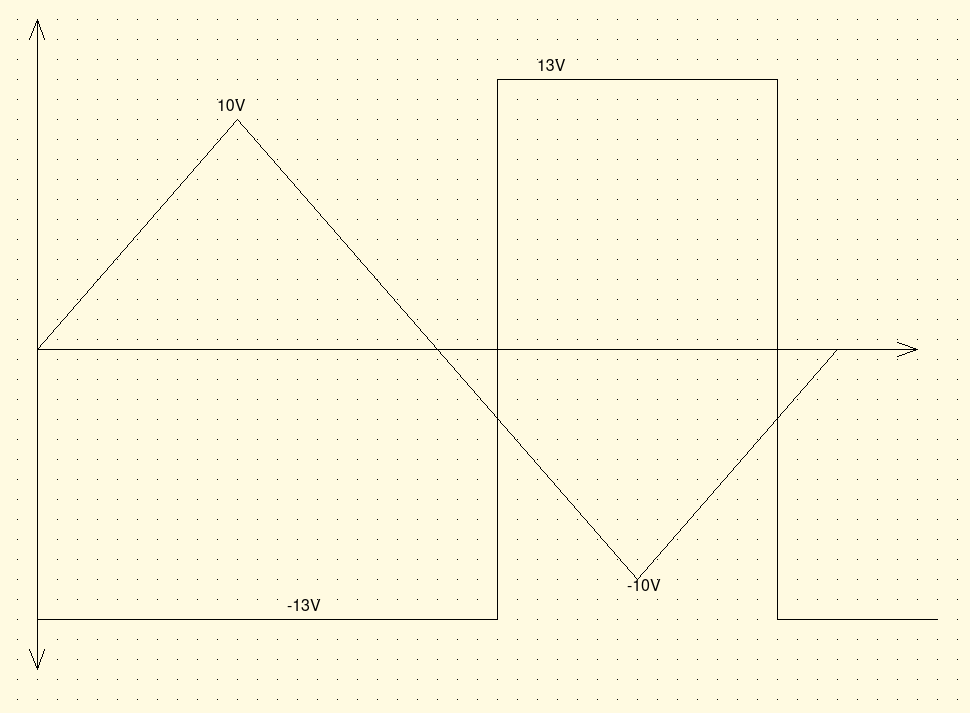

14. Sketch the input-output characteristic curve given:
    $$
    R_1=9.7k\Omega\\
    R_2=3.2k\Omega\\
    V_{O_{SAT}}=\pm14V
    $$
    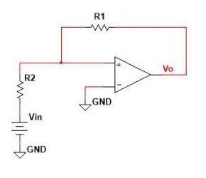

    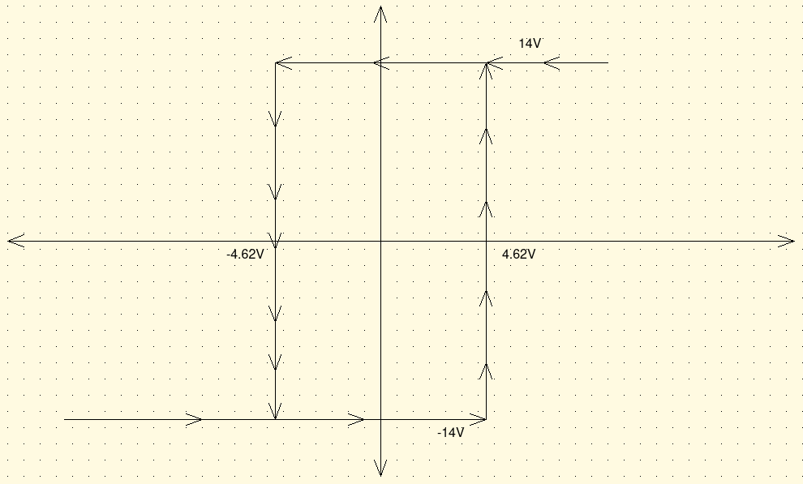

15. Sketch the output curve given the diagram in question 14 and:
    $$
    R_1=8.1k\Omega\\
    R_2=4.7k\Omega\\
    V_{O_{SAT}}=\pm14V
    $$
    
    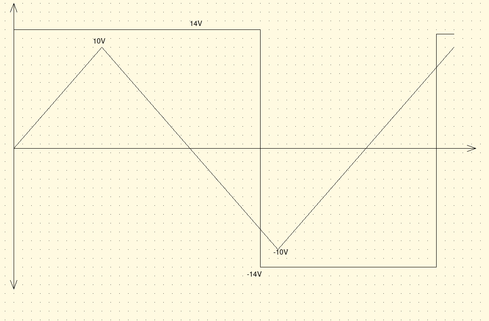

16. Determine the current $I_1$ given all resistors are $2.0k\Omega$ except $R_{1b}$, which is $4.6k\Omega$, and $V_{in1}=6V,\ V_{in2}=13V$.
    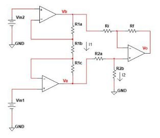
    $$
    i_1={v_1-v_2\over R_{1b}}={6V-13V\over 4.6k\Omega}\\
    \overline{\underline{|i_1=1.5mA|}}
    $$

17. Using the same circuit and values, determine $I_2$.
    $$
    V_a=I_1(R_{1c})=1.52mA*2k\Omega=3.04V\\
    3.04V+6V=9.04V\\
    I={V\over R}={9.04V\over4k\Omega}\\
    \overline{\underline{|I_2=2.26mA|}}
    $$

18. A 4 pole high pass Butterworth filter has a 3dB cutoff of 6MHz. Use the image below to determine the decibel response at 2MHz.
    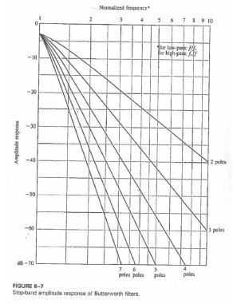
    $$
    \approx-38dB
    $$

19. Design a 2 pole low-pass butterworth active filter using the unity-gain amplifier (below) to achieve a 3dB frequency of 6KHz. Select the two filter resistances at $12k\Omega$ each. Starting values for C~1~ and C~2~ are 1.414 and 0.707 respectively.
    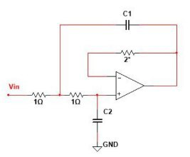
    $$
    R=12k\Omega\\
    C_1={1.414F\over12k*2*\pi*12k}=1.56nF\\
    C_1={0.707F\over12k*2*\pi*12k}=0.78nF\\
    $$
    
20. What is the minimum order needed for a high pass filter that has a relative amplitude of $\le0.100dB\ for\ f\ge4.0kHz,\ and\ \ge30.0dB\ for\ f\le0.600kHz$.
    3 poles.

21. What has been the most confusing point so far in this class?