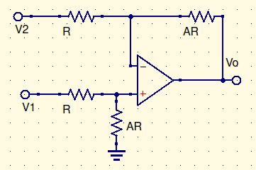
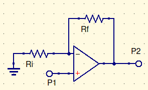

# Basics

$$
\beta={R_i\over R_f+R_i}=\frac{1}{A_{CL_{IDEAL}}}=\frac{1}{k_n}\\
\alpha={R_f\over R_i+R_f}\\
Z_i=(1+A_O\beta)r_d\\
Z_o={r_o\over 1+A_0\beta}\\
A_{CL}={A_0\over1+A_0\beta}\\
$$

# Internal Calculations

$$
V_{o1}=V_{io}(\alpha)\\
V_{o2}=R_c(\alpha)i_b^+-R_f(I_b^2)\\
i_{io}=i_b^+-i_b^-;\ i_b={i_b^++i_b^-\over2}\\
V_0=-R_fi_i<V_{sat}\\
V_0=V_{io}({1\over\beta})\\
V_0=I_{b+}({1\over\beta})\\
V_0=I_B(R_C{1\over\beta}-R_f)\\
R_C=R_i\|R_f
$$

# Differential Amplifier

$$
{V-V_1\over R}+{V\over AR}=0\\
{AV\over AR}+{V\over AR}={V_1\over R}\\
{V_1A\over A+1}=V\\[25pt]
{V-V_2\over \cancel R1}+{V-V_o\over A\cancel R}=0\\
V-V_2+{V_1\over 1+A}={V_o\over A}\\
{V_1\cancel{(A+1)}\over \cancel{(A+1)}}-V_2={V_o\over A}\\
\underline{\overline{|V_o=A(V_1-V_2)|}}
$$

#

# Non inverting op amp

$$
A_{CL}={A_{ideal}\over1+({1\over A\beta})}= {A_{ideal}\over1+({k_n\over A})}\\
{V_o\over V_i}=k_n
$$

$$
A\ne A_0\ne A_{CL}
$$

# Inverting op amp

$$
A_{CL}={A_{ideal}\over1+({1\over A\beta})}= {A_{ideal}\over1+({K_n\over A})}\\
{V_o\over V_i}={-R_f\over R_i}
$$

# Open loop gain

$$
A={A_0\over 1+j({f\over f_1})}\\
A_0=given\\
f=freq\\
f_1=cutoff\ freq
$$

# Gain

$$
A={A_0\over1+j{f\over f_1}}\\
|A|={A_0\over\sqrt{1+({f\over f_1})^2}}\\
|A|_{dB}=20(logA_0-log(\sqrt{1+({f\over f_1})^2}))
$$

| $f$    | gain (dB)      |
| ------ | -------------- |
| $0.1$  | $\approx120$   |
| $1$    | $\approx120$   |
| $10$   | $\approx120-3$ |
| $100$  | $100$          |
| $1_E4$ | $80$           |

$B=A_0f_1$, where $B$ is the unity gain frequency

$$
A_{OL}={A_0\over 1+j({f\over f_1})}\\
A_{CL}={A_{IDEAL}\over 1+{k_n\over A_{OL}}}
$$
==$A_{CL}={{A_{IDEAL}\over1+{k_n\over A_0}}\over 1+j({fk_n\over B(1+{k_n\over A_0})})}$==

# Finite Bandwidth Effect

This is a curve from low to high

$T_R$= rise time

$BW_{CL}$= closed loop bandwidth

$B$=unity gain frequency
$$
BW_{CL}=\frac{B}{k_n}\\
$$

# Finite Slew Rate Effect

This is what produces the sawtooth effect

$T_{SR}$=rise time

$S$=slew rate, measured in $V/\mu s$
$$
f_{sr}=\frac{S}{2\pi V_o}=\frac{1}{T_{sr}}
$$