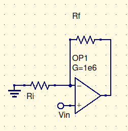

# Important info for lab

Input resistance

$R_{in}=R_d(1+A\beta)$

Gain

${V_o \over V_{in}}={A \over 1+A\beta}$

output resistance

$r_{out}={r_o\over 1+A\beta}$

$r_d$ is the resistance between the inputs.

$r_o$ is the resistance on the output after the source.

The source within is represented as $A_v(v_+-v_+)$

${R_i \over R_i + R_f}=\beta$ is the feedback factor. $\alpha={R_f\over R_i+R_f}$ is the control factor. A is the open-loop gain. (Closed-loop gain is when the output feeds back into the input)

$R_i$ is the input resistor

$R_f$ is the feedback resistor. It is ALWAYS back to the negative.

# Simple feedback op-amp for examples

## Gain

If A is finite, and $r_d$ and $r_o$ are neglected, then the gain = ${R_i+R_f \over R_i}={1\over \beta}$

## Input resistance

$$
goal\\
r_{in}={1V\over I_{in}}\\
.\\
0={v_-- 0\over R_i}+{v_-- V_{in}\over r_d}+{v_-- V_o\over R_f}\\
i_{in}={1- V_- \over r_d}\\
0=V_-({R_iR_f+r_dR_f+r_dR_i \over R_ir_dR_f})-{1\over r_d}-{A(1-v_-) \over R_f}\\
0=V_-({(R_iR_f+r_dR_f+r_dR_i(1-A)) \over R_ir_dR_f})-{1\over r_d}-{A\over R_f}\\
1-i_{in}r_d=V_-\\
0=(1-i_{in}\cancel {r_d})({(R_iR_f+r_dR_f+r_dR_i(1-A)) \over R_i\cancel {r_d}R_f})-{1\over r_d}-{A\over R_f}\\
0=(1-i_{in})(1+{r_d\over R_i}+{r_d(1-A)\over R_f})-{1\over r_d}-{A\over R_f}\\
0=1-i_{in}+{r_d\over R_i}+{r_d(1-A)\over R_f}-{r_di_{in}\over R_i}-{r_d(1-A)i_{in}\over R_f}-{1\over r_d}-{A\over R_f}\\
i_{in}(1+{r_d\over R_i}+{r_d(1-A)\over R_f})={r_d\over R_i}+{r_d(1-A)\over R_f}-{1\over r_d}-{A\over R_f}
$$

