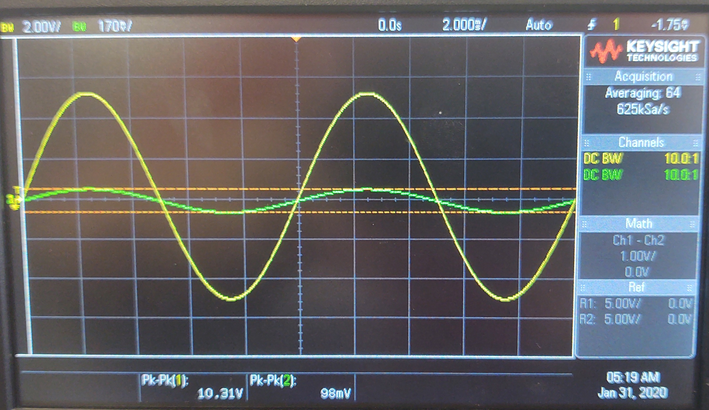
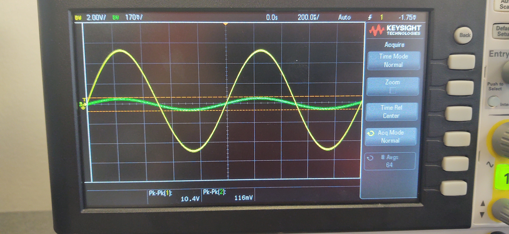
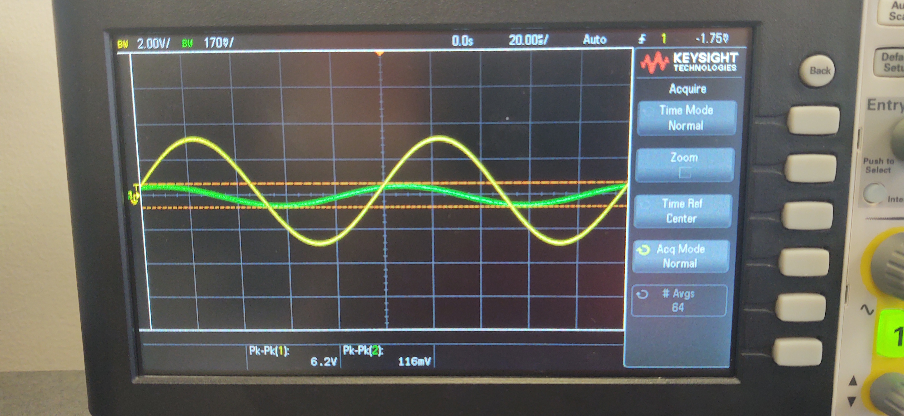
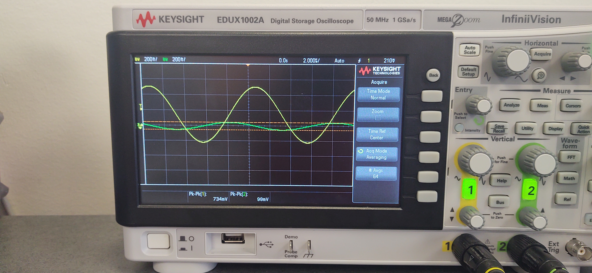

$$
A={V_o\over V_i}={10.31V\over 98mV}\approx105
$$

$$
A={V_o\over V_i}={10.4V\over 116mV}\approx89.7
$$

$$
A={V_o\over V_i}={6.2V\over 116mV}\approx53.4
$$

$$
A={V_o\over V_i}={734mV\over 98mV}\approx7.49
$$
