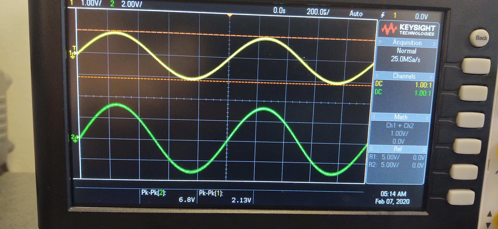
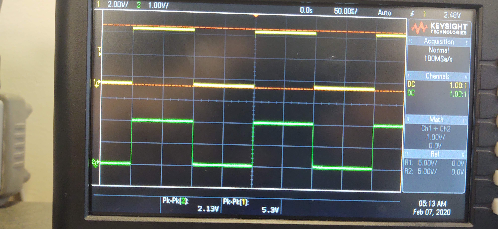
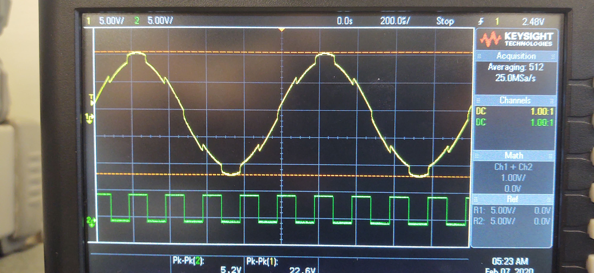

In this lab, we build a series of operational amplifiers. We tested each one individually, to ensure that they worked. Then, we connected one to a sine wave, and another to a square wave, and connected the two together. This resulted in a final output waveform that looks like a square wave overlaid over a sine wave.

$$
A_{CL_{theory}}={1\over \beta}={R_i+R_f\over R_i}={1k\Omega+2.2k\Omega\over2.2k\Omega}\\
A_{CL_{theory}}=1.45\\
A_{CL_{lab}}={V_o\over V_i}={6.8V\over2.13V}\\
A_{CL_{lab}}=3.19
$$

$$
A_{CL_{theory}}={1\over \beta}={R_i+R_f\over R_i}={5.6k\Omega+1k\Omega\over5.6k\Omega}\\
A_{CL_{theory}}=1.17\\
A_{CL_{lab}}={V_o\over V_i}={5.3V\over2.13V}\\
A_{CL_{lab}}=2.49
$$
