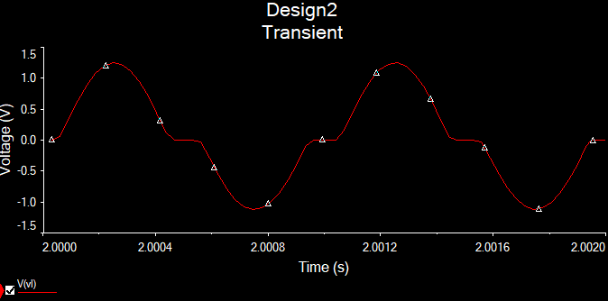

# Skyler MacDougall

## Lab 3 : Intro to Op-Amps

---

### Circuit 1:

### Circuit 2:

### Circuit 3:

### Circuit 4: 

$$
A_{CL_{theory}}={-R_f\over R_i}={-5.6k\Omega\over2.2k\Omega}=-2.\overline{54}\\
A_{CL}={V_o\over V_i}={50V\over1.99V}\approx25
$$

### Circuit 5

$$
A_{CL_{theory}}={R_f+R_i\over R_i}={2.2k\Omega+ 5.6k\Omega \over 2.2k\Omega}=3.\overline{54}\\
A_{CL}={V_o\over V_i}={38V\over20.3V}\approx1.82
$$

---

Circuit 3 does not have distortion at the peaks of the waveform, making it better than Circuit 1. It also has no distortion in the middle of the waveform, making it better than Circuit 2. The inverting gain calculation does not appear to work in this instance (I may have grabbed the wrong resistor). The minus sign refers to the fact that the amplitude is inverted compared to the input signal. The non-inverting gain does not appear to work either. Finding the datasheets was rather difficult, although I would assume that in the real world, when buying devices, they come with some form of datasheet, either digital or physical.
