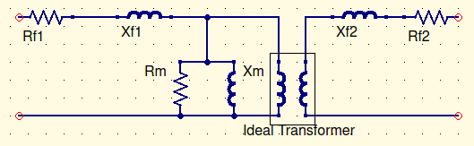

# Transformers

$R_m$ is the heat losses in the transformer.

$X_m$ accounts for inperfections in power transfer.
$$
R_m>>R_f\\
X_m>>X_f\\
\therefore\ ignore\ voltage\ across\ R_f\ and\ X_f\\
R_m={E_p^2\over P_m}\\
S_m=E_p\times I_m\\
X_m={E_p^2\over Q_m}\\
Q_m=\sqrt{S_m^2-P_m^2}
$$
$R_p$ total transformer resistance referred to primary side

$X_p$ total transformer reactance referred to on the primary side

Short the secondary, then:
$$
R_p=R_{f_1}+a^2R_{f_2}\\
X_p=X_{f_1}+a^2X_{f_2}\\
Z_p=\sqrt{R_p^2+X_p^2}\\[16pt]
Find\ I_p\ and\ P_p\ to\ find\ values\ of\ R_p\ and X_p\\[16pt]
if\ X_p>>5R_p\\ neglect\ R_p
$$

Subtract S from the rating to get the actual usable power