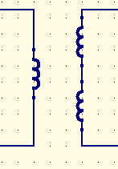
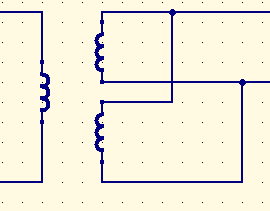
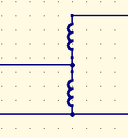
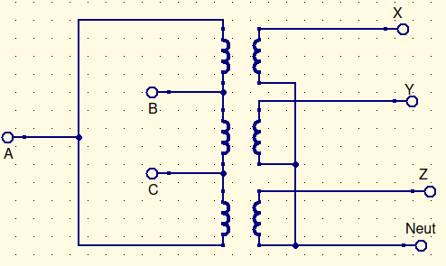

# Chapter 11

Withstand current = $I_{sc}$

$Z_{thev} = {V_{nominal} \over I_{sc}}$

## Dual Voltage Transformers

usually single phase

usually residential

Medium voltage primary

Secondary is (2) 120V secondaries. There’s 3 wires. One thats bare wire (neutral), and 2 wires for power, both at 120V. Just like the transformer that we used in lab.

The transmission lines generally go to multiple households. This makes it easier to balance the load.

Large buildings normally have $208V_{line}$, or $120V$ in a 3-phase, wye power. 

## Autotransformers

Primary turns $N_p$

Secondary turns ($N_s$)

$V_s=\frac{N_s}{N_p}\times V_p$

Turns ratio $a=\frac{N_s}{N_p}$

$I_pN_p=I_sN_s$

$I_p$ and $I_s$ are both down

There’s a problem: Theres no isolation between the primary and the secondary. Its cheaper, but noise problems are still there.

They’re normally labeled, but our professor is an asshole, so we don’t know in lab.

Don’t use a nail as a fuse.

# Chapter 12: 3-Phase

It… its just 3 transformers

## Delta-Wye configuration

Left is $\Delta$, right is $Y$

Name-plate:

$480-208$ = $\Delta-\Delta$

$480/277-208/120$=$Y-Y$

These can be in any combination

