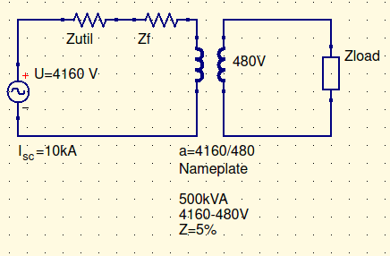

# Special Transformers

## Instrumentation transformers

6900V line. Its hard to make a meter for that. So, we make special transformers so we can measure it.

### Potential Transformer

book calls em “Voltage transformers”

denoted as PTs, POTs, or VTs

Used for monitoring voltage and power.

This is what your power meter is on the side of your house

Made to have a high impedance. This means that you don’t have much power on the low voltage side, so its more accurate.

### Current Transformers

used for monitoring current. 

denoted as CTs

Usually 1 turn around the incoming cable. 

Used in contactless current measurement

Used for exceedingly high currents (>400A)

If you ever deal with a current transformer, don’t touch it. The voltage on the meter is GIANT. And WHATEVER YOU DO. ==DON’T BREAK THE CIRCUIT.==

Always ground the secondary.

# Large Design Problem

Given voltage and short-circuit/widthstand current

$$
V_{util}=U
$$
You may be given $X\over R$

Awesome. Now we know what the utility looks like.

This is all what we’ve done in class so far.

Now, we’re gonna add a transformer.

$$
Z_{base}=\frac{E_p^2}{S}=\frac{4160V^2}{500kVA}\\
Z_{base}=34.6\Omega\\
Z_f=Z_{base}\times5\%\\
Z_f=1.73\Omega
$$
Now we’re gonna add a load.

Alright. Given this, use the calculations above, and the following:
$$
Z_{util}={4160V\over10kA}=0.416\Omega
$$
You can now convert to a simple circuit like this:

[^1]

This can help you find $I_p$. You can then calculate $I_s$, calculate power, etc. etc. etc.

Or, you can find $V_p$ for the transformer. This can also be represented at $V_{FL}$

Now we can find regulation:
$$
regulation={V_{NL}-V_{FL}\over V_{FL}}
$$
We can also find efficiency:
$$
Efficiency ={P_{out}\over P_{in}}={V_{load}\times I_{load}\over V_{util}\times I_p}
$$

## Simple Circuit Review

Given a simple circuit, with just $Z_{in}$ and $V_{in}$

All given numbers are in RMS

If you are asked to graph the waveform, tack a $\sqrt2$ on the end.

Inductors lag, capacitors lead

Review line vs phase

Review delta vs wye

[1]:a2 actually means $a^2$, but qucs doesn’t understand powers in component names