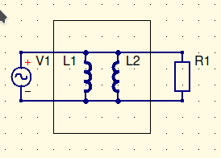

# Transformers

We will always assume an iron core. It will be stated if you don’t have one. Two lines between inductors indicates transformer

Riser diagrams go from bottom to top. This shows the physical locations of the circuitry. Traditional diagrams only show power, and are generally left to right, or vice versa

$$
I_p={I_S\over a}\\
V_p=V_sa
$$
Given these two, your remembered calculations will find the power and the perceived impedance on either side

You can find your source impedance for something you own. But for utilities, they give you the widthstand current or available short circuit current. Given that and the voltage, you can find the impedance. 

---

RIT recently announced the construction of a new building on campus. A $120V,\ 60Hz$ generator located 100 miles from campus will supply power to the building. The internal resistance of the generator is $0.01\Omega$.

The proposed Transmission line has the resistance of $0.25\Omega \ per\ 1000ft$. The steady state load of the building is $1.0\Omega$. 

- Draw a circuit based on this representation of the project.
- calculate the resistance of the transmission line $R_{trans}$
- Calculate the voltage at the building $V_B$
- Calculate the power delivered to the building $P_B$

The load of the transmission lines comes out to $132k\Omega$

This transmission load is difficult to deal with without a transformer. So, lets add one. Actually, no. Lets add 2.
