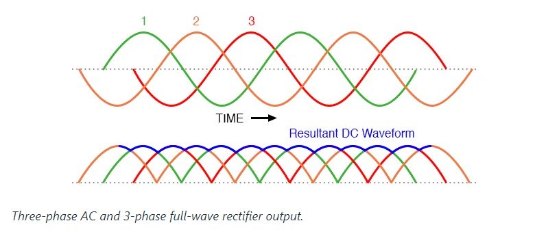
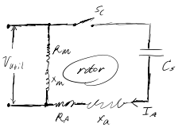

# Skyler MacDougall

## Exam 3

1.  

    The current will go up, because the current requirements will still be the same for the motor. I can barely find anything saying the mathematics of this. Quora is the only place I could find any math remotely similar to what we were looking for, which follows below.

    $2.4*20A=48A$

    

2.  Define the following terms:

    -   Slip of a Synchronous Generator
        The difference in speed (in percent) between the synchronous speed (the frequency of the output signal) and the rotational speed (the speed of the rotor).
    -   Armature of a generator
        The rotating portion of the generator. When in a motor, this is the rotor.
    -   Rotating AC field generator vs Stationary AC Field Generator
        Rotating AC field generators have stationary magnetic fields, while stationary AC field generators have rotating magnetic fields.
    -   Permanent Magnet generator (explain benefits and whether its a stationary or rotating AC field generator)
        Permanent Magnet generators are stationary AC fields. Permanent Magnet generators are cheaper to build.
    -   Infinite bus
        The bus who's voltage and frequency remains constant even after variation in the load. 

3.  For a single Phase Capacitor Start Motor running at 240V<60Hz at a speed of 1700rpm, running a water pump. Calculate the following:

    1.  What is the synchronous speed of the motor?
        $$
        n_s=120{f\over p}=\cancel{120}40*{\cancel{60}20Hz\over1\cancel{9}}\\
        \overline{\underline{|n_s=1800rpm|}}
        $$

    2.  What is the slip of the motor?
        $$
        s={n_s-n\over n_s}={1800rpm-1700rpm\over1800rpm}\\
        \overline{\underline{|s\approx5.\overline5|}}
        $$

    3.  How many poles does this motor have?
        $$
        9
        $$

    4.  Draw a circuit that shows this motor and how it works. Make sure you show both windings.
        

    5.  Explain how the motor starts?
        Close the switch, then rotate the rotor.

    6.  After installing this motor, we find that the rotational direction of the motor is backwards. How do we change this so the pump will always run in the correct rotational direction?
        If the rotor is in motion, stop the rotor. Then, reverse the polarity of the windings.

4.  For a regular DC motor, define the following:

    1.  Is the motor a stationary or rotational field motor? Explain.
        The motor is like a rotational field motor because it uses permanent magnets.
    2.  What is a Split Ring? What does it do?
        A split ring is a cylindrical shell split in 2 halves, the power transfers from the split rings through the brushes and into the rotor. The split ring keeps the DC motor turning in one direction.
    3.  What is a commutator?
        A commutator switches the direction of the current at certain intervals which allows the motor to rotate in one direction continuously.
    4.  Is the speed of a DC motor proportional to the applied voltage?
        The speed of a DC motor is directly proportional to the applied voltage. 

5.  Explain/define

    1.  What does ECM mean?
        Electronically commutated motor.
    2.  What is an ECM motor?
        A motor which uses electronics to control its speed.
    3.  How does an ECM motor work?
        An ECM motor works like any other motor except that its speed is dictated by a microprocessor housed in the motor's shell. 
    4.  How is this motor different than a regular DC motor?
        A regular motor requires a change in applied voltage to change its speed. An ECM motor can regulate its speed without a change in applied voltage.
    5.  What is the armature of an ECM motor?
        The armature of an ECM motor is its rotor.

6.  a 150KVA 480VAC Permanent Magnet Generator (powered by a diesel engine) has an impedance Z of $5\Omega$ with a normal reactance X of $4\Omega$.

    1.  The generator has a sub-transient reactance of $0.5\Omega$ (occurs for the first 3 cycles where there is a short circuit). What is the short circuit current available from the generator for the short circuit immediately after the short circuit occurs?
        $$
        I_b={S\over\sqrt3E_b}={150K\cancel{V}A\over\sqrt3*480\cancel{V}}=180.4A\\
        I"={1\over X"}*X_s*I_b={1\over 0.5\Omega}*4\Omega*180.4A\\
        \overline{\underline{|I"=1443A|}}
        $$

    2.  The generator has a transient reactance of $1\Omega$ (occurs after the short circuit has occurred and is maintained for a long period of time). What is the current from the generator if the short circuit is maintained?
        $$
        I_b=180.4A\\
        I'={1\over X'}*X_s*I_b={1\over 1\cancel {\Omega}} *4 \cancel{\Omega} *180.4A\\
        \overline{\underline{|I'=721A|}}
        $$