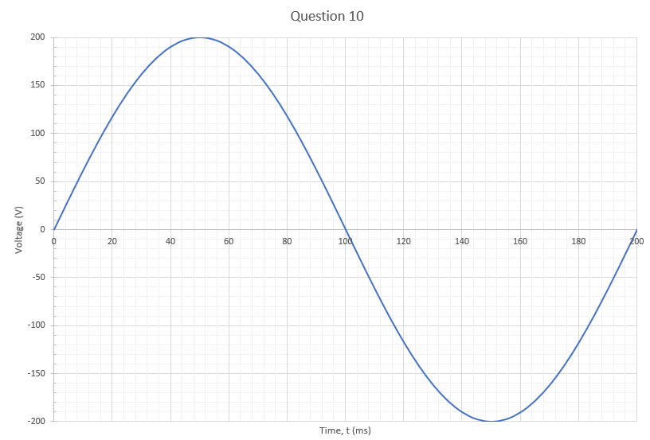
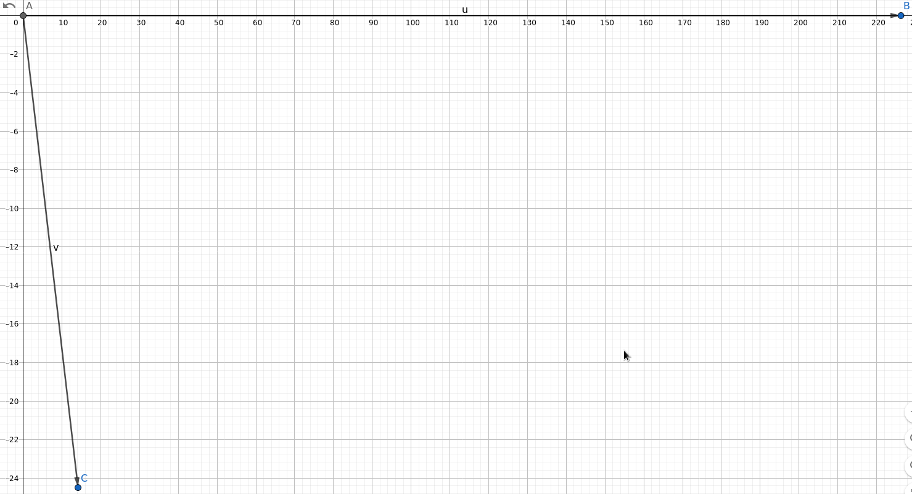
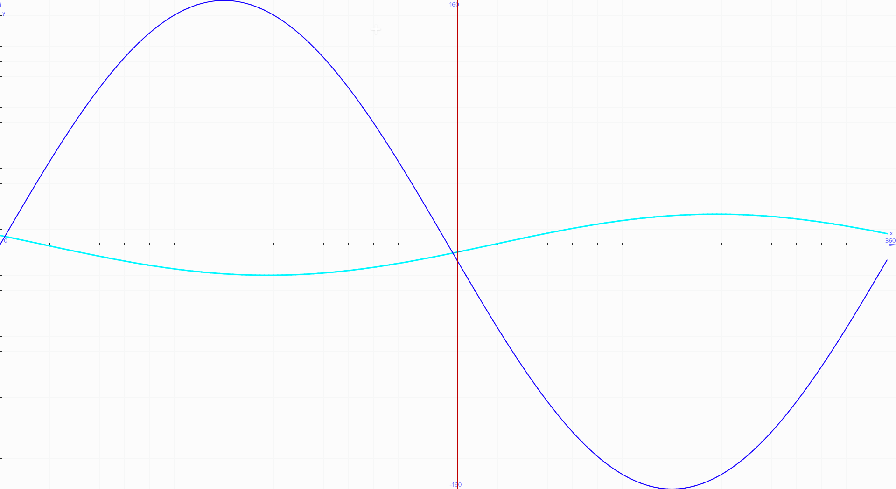

## Skyler MacDougall

### Homework 1: Due 1/22/2020

10.  

     1.  Draw a waveshape of a sinusoidal voltage having a peak value of 200V and a frequency of 5Hz.
         

     2.  If the voltage is zero at $t=0$, what is the voltage at $t=5ms$? $75ms$?$150ms$?

         | Time (t, ms) | Voltage (V)   |
         | ------------ | ------------- |
         | 5            | $\approx31$   |
         | 75           | $\approx 141$ |
         | 150          | $-200$        |

11.  A sinusoidal current has an effective value of 50A. Calculate the peak value of current.
     $$
50A*{\sqrt{2}\over2}\approx35A
     $$
     
12. A sinusoidal voltage of 120V is applied to a $10\Omega$ resistor. Calculate

    1. the effective current through the resistor.

        $$
        {120V\over 10\Omega}=12A
        $$
    
2. the peak voltage across the resistor.
   
    $$
        120V*\sqrt{2}\approx170V_{RMS}
    $$
    
    3. the power dissipated by the resistor.
        $$
        120V*12A=1440W
        $$
    
    4. The peak power dissipated by the resistor.
        $$
        170V_{RMS}*(12A*\sqrt{2})=2880W
        $$
    
    
    
13. A distorted voltage contains an 11^th^ harmonic of 20V, 253Hz. Calcultate the frequency of the fundamental.

    $$
    235Hz*11^{th}Harmonic\approx2.6kHz
    $$

14. The current in a 60Hz single phase motor lags 36 degrees behind the voltage. Calculate the time interval between positive peaks of voltage and current.

    $$
    {1\over \cancel{60Hz}}*{\cancel{360^\circ}6^\circ\over 36^\circ}={1\over 6}seconds=0.1\overline{66}seconds
    $$

15. Determine the phase angle between the following phasors and, in each case, indicate which phasor is lagging.

    

    1. $I_1$ and $I_3$

       
        $$
        \angle I_1-\angle I_3=-60^\circ\\
        \therefore\\
        I_1 lags I_3by60^\circ
        $$
        
2. $I_2$ and $I_3$
    
    $$
        \angle I_2-\angle I_3=-90^\circ\\
        \therefore\\
        I_2 lags I_3 by 90^\circ
        $$
    
3.  $E$ and $I_1$
    
    $$
        \angle E - \angle I_1=-150^\circ\\
        \therefore\\
        ElagsI_1by150^\circ
        $$
    
16.  The voltage applied to an AC magnet is given by the expression $E=160sin\phi$, and the current is $I=20sin(\phi-60^\circ)$, all angles being expressed in degrees.

     1.  Draw the phasor diagram for $E$ and $I$, using effective values.

         

     2.  Draw the waveshape of $E$ and $I$ as a function of $\phi$.

         

     3.  Calculate the peak positive power and the peak negative power in the circuit.

         
         
         