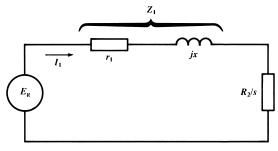
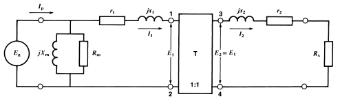
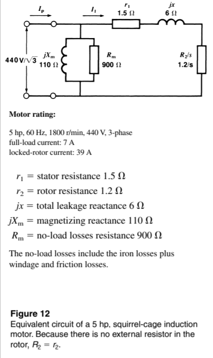
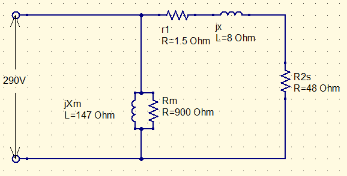

# Skyler MacDougall

## Homework 10: due 3/30/2020

2. A wye-connected squirrel-cage motor having a synchronous speed of 900r/min has a stator resistance of $0.7\Omega$ and an equivalent rotor resistance of $0.5\Omega$. If the total leakage reactance is $5\Omega$ and the line-to-neutral voltage is 346V, calculate the following:

    1. The value of $Z_1$ and the angle $\alpha$
    $$
        Z_1=\sqrt{R_1^2 +x^2}=\sqrt{0.7^2 +5^2}\\
    Z_1=5.048\Omega\\
        \alpha=tan^{-1}({X\over R_1})=tan^{-1}({5\Omega\over 0.7\Omega})\\
    \alpha=82.03^\circ
        $$
    
    
    2. The speed when the breakdown torque is reached
        $$
        n_b=n_s(1-({R_2\over Z_1}))=900(1-({0.5\Omega\over 5.048\Omega}))\\
        \underline{\overline{|n_b=810.85|}}
        $$
        
    
    3. the current $I_1$ at the breakdown torque (see below)
    
        
        $$
        I_1={E_L\over2 Z_1 cos({\alpha\over 2})}={346V \over 2 * 5.048 * cos( {82.03^\circ \over 2})}\\
        \overline{\underline{|I_1=45.419A|}}
        $$
        
    
    4. The value of the breakdown torque [N*m]
        $$
        T_b={9.55(I_1^2Z_1)\over n_s}={9.55(45.419A^2* 5.048\Omega)\over 900r/min}\\
        \overline{\underline{|T_b=110.498N*m|}}
        $$
        

4. A 550V, 1780r/min, 3-phase, 60Hz, squirrel cage induction motor running at no-load draws a current of 12A and a total power of 1500W. Calculate the value of $X_m$ and $R_m$ per phase.

    

$$
S=VA=550V*12A=6.6kVA\\
Q=\sqrt{6.6kVA^2-1.5kW^2}=6.4kVAR\\
R={V\over P}={550V\over 1500W}\\
X={V\over Q}={550V\over 6.4kVAR}\\
\underline{\overline{|R=0.3\overline6\Omega;X=0.09\Omega|}}
$$

9.  Consider the 5hp motor whose equivalent circuit shown below.
    

    1.  Calculate the values of the inductances (in mH) of the leakage and magnetizing reactances.
        $$
        L_m={X\over 2\pi f}={110\Omega\over 2\pi(60Hz)}\\
        L_x={X\over 2\pi f}={6\Omega\over 2\pi(60Hz)}\\
        \overline{\underline{|L_x=15.9mH;\ L_m=291.8mH|}}
        $$

    2.  Determine the values of the leackage reactance and magnetizing reactance at a frequency of 50Hz.
        $$
        X_m=L_m*2\pi f=15.9mH*2\pi *50Hz\\
        X_m=L_m*2\pi f=291.8mH*2\pi *50Hz\\
        \overline{\underline{|X=5\Omega;\ X_m=91.6\Omega|}}
        $$

    3.  Calculate the 50Hz line to neutral voltage to obtain the same magnetizing current and compare it with the voltage at 60Hz.
        $$
        V'=V*{f_2\over f_1}={440\over\sqrt3}V*{50Hz\over60Hz}\\
        V'\approx212V
        $$

10.  The 5hp motor represented by the equivalent circuit of the image above is connected to a 503V(line-to-line), 3-phase, 80Hz source. The stator and rotor resistances are assumed to remain the same.

     1.  Determine the equivalent circuit when the motor runs at 2340r/min.

         

     2.  Calculate the value of the torque [N*m] and the power [hp] developed by the motor. 
         $$
         
         $$
         