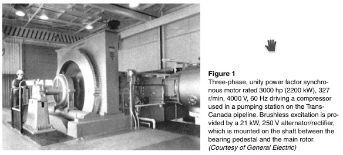
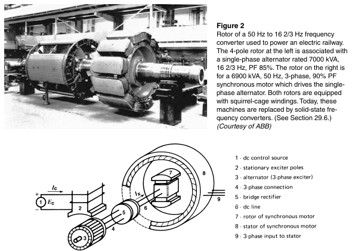
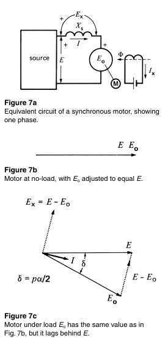
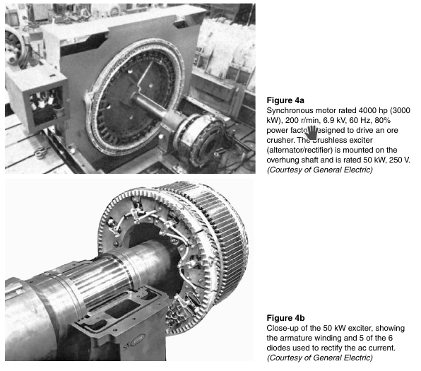

# Skyler MacDougall

## Homework 11: due 4/1/2020

9. A 3-phase, 225r/min synchronous motor connected to a 4kV, 60Hz line draws a current of 320A and absorbs 2000kW. Calculate:

    1. The apparent power supplied to the motor.
    2. The power factor.
    3. The reactive power absorbed.
    4. The number of poles on the rotor.

10. A synchronous motor draws 150A from a 3-phase line. If the exciting current is raised, the current drops to 140A. Was the motor over- or under-excited before the excitation was changed?

11.  

    1. Calculate the approximate full-load current of the 3000hp motor in the image below, if it has an efficiency of 97%.

        

    2. What is the value of the field resistance?

12. Referring to the image below, at what speed must the rotor turn to generate the indicated frequencies?
    

14. A synchronous motor has the following parameters, per phase
    
    $$
    E=2.4kV;\ E_o=3kV\\
    X_s=2\Omega\\
    I=900A
    $$
    Draw the phasor diagram.

    

    Then, determine:

    1. Torque angle $\delta$
    2. Active power, per phase
    3. Power factor of the motor
    4. Reactive power absorbed/delivered per phase

15.  

    1. In problem 14, calculate the line current and the new torque angle $\delta$ if the mechanical load is suddenly removed.
    2. Calculate the new reactive power absorbed/delivered by the motor, per phase.

16. A 500hp synchronous motor drives a compressor and its excitation is adjusted so that the power factor is unity. If the excitation is increased without making any other change, what is the effect on the following:

    1. The active power absorbed by the motor.
    2. The line current.
    3. The reactive power absorbed/delivered by the motor.
    4. The torque angle.

17. The 4000hp, 6.9kV motor shown below posesses a synchronous reactance of $10\Omega$ per phase. 

    
    The stator is connected in wye, and the motor operates at full-load (4000hp) with a leading power factor of 0.89. If the efficiency is 97%, calculate the following:

    1. The apparent power
    2. The line current
    3. The value of $E_o$ per phase
    4. The mechanical displacement of the poles from their no-load position
    5. The total reactive power supplied to the electrical system.