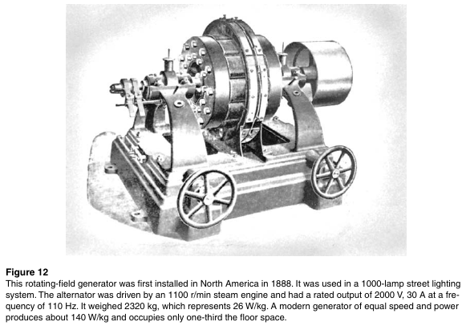
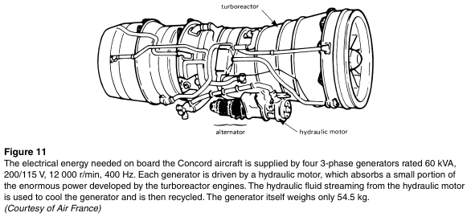
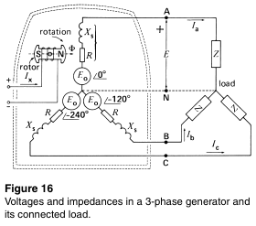
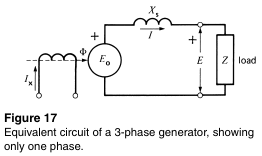

# Skyler MacDougall

## Homework 12: due 4/8/2020

3. In analyzing a hydropower site, it is found that the turbines should turn at close to 350r/min. If the directly coupled generators must generate a frequency of 60Hz, calculate the following:

    1. The number of poles on the rotor
    2. The exact turbine speed

4. An isolated 3-phase generator produces a no-load line voltage of 13.2kV. If a load having a lagging power factor of 0.8 is connected to the machine, must the excitation be increased or decreased in order to maintain the same line voltage?

5. What conditions must be met before a generator can be connected to a 3-phase system?

6. Calculate the number of poles on the generator in figure 12 below using the information given.

    

7. Calculate the number of poles on the aircraft generator shown in the figure 11 below. 

    

16. The 3-phase generator shown in the figure 16 below has the following characteristics:

    
    $$
    E_o=2440V\\
    X_s=144\Omega\\
    R=17\Omega\\
    Z=175\Omega (resistive)
    $$
    Calculate

    1. The synchronous impedance $Z_s$ per phase
    2. The total resistance of the circuit per phase
    3. The total reactance of the circuit per phase
    4. the line current
    5. the line-to-neutral voltage across the load
    6. the line voltage across the load
    7. the power of the turbine driving the alternator
    8. the phase angle between $E_o$ and the voltage across the load

22. Referring to the figure 17 below, the following information is given about the generator:

    
    $$
    E_o=12kV\\
    E=14kV\\
    X_s=2\Omega\\
    E_o\ leads\ E\ by\ 30^\circ
    $$

    1. calculate the total active power output of the generator
    2. draw the phasor diagram for one phase
    3. calculate the power factor of the load