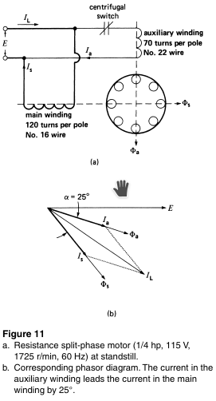
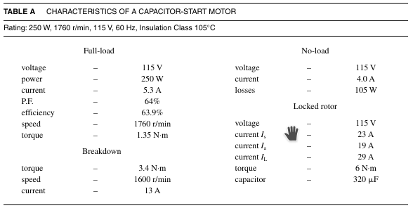

# Skyler MacDougall

## Homework 13: due 4/15/2020

8. Which of the motors discussed in this chapter is best suited to drive the following loads:

    1. a small portable drill
    2. a 3/4hp air compressor
    3. a vacuum cleaner
    4. a 1/100hp blower
    5. a 1/3hp centrifugal pump
    6. a 1/4hp fan for use in a hospital ward
    7. an electric timer
    8. a hi-fi turntable

9. Referring to the figure 11 below, the effective impedance of the main and auxiliary windings under locked-rotor conditions were given as follows:
    

    |              | Effective Resistance | Effective Reactance |
    | ------------ | -------------------- | ------------------- |
    | Main winding | $4\Omega$            | $7.5\Omega$         |
    | Aux winding  | $7.5\Omega$          | $4\Omega$           |

    If the line voltage is 119V, calculate the following

    1. the magnitude of $I_a$ and $I_s$
    2. the phase angle between $I_a$ and $I_s$
    3. the line current $I_L$
    4. The power factor under locked rotor conditions

12. A single phase motor vibrates at a frequency of 100Hz. What is the frequency of the power line?

17. The motor described in the table has an LR power factor of 0.9 lagging. 

    
    It is installed in a workshop situated 600ft from a home, where the main service entrance is located. The line is composed of 2-conductor cable made of No. 12 gauge copper. The ambient temperature is $25^\circ C$ and the service entrance voltage is 122V. Calculate:

    1. The resistance of the transmission line
    2. The starting current and the voltage at the motor terminals
    3. the starting torque [N*m]