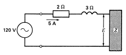

## Skyler MacDougall

### Homework 2: Due 1/22/2020

7. A large motor absorbs 600kW at a power factor of 90%. Calculate the apparent power and reactive power absorbed by the machine.

    $$
    P=600kW; pf={P\over S};pf=0.9\\
    {P\over pf}=S={600kW\over0.9}\\
    666.\overline6kVA=S
    $$
    
13. A single-phase motor draws a current of 16A from 240V, 60Hz. A wattmeter connected to the line gives a reading of 2765W. Calculate the power factor and the reactive power.
    $$
    P=2765W; pf={P\over S}\\
    16A*240V=3840VA\\
    pf={2765W\over 3840VA}\approx0.77\\
    cos^{-1}(77)=\theta_{diff}\approx39^\circ\\
    Q=VI(sin(\theta_{diff}))=16*240*sin(39^\circ)\\
    Q\approx3775VAR\\
    answers:\\
    Q\approx3775VAR;pf\approx0.77or77\%
    $$
    
14. if a capacitor having a reactance of $30\Omega$ is connected in parallel with the motor in question 13, calculate
    1. The active power reading of the wattmeter.

        Since capacitors are solely reactive, the real power used does not change. Therefore, it is still 2765W.

    2. The total reactive power absorbed by the capacitor and the motor.
        $$
        {240V^2\over 30\Omega}=1920VAR\\
        Q=3775VAR-1920VAR=1855VAR\\
        $$

    3. The apparent power of the AC line.
        $$
        S=\sqrt{2765W^2+1855VAR^2}\\
        S\approx3329VA;
        $$
    
4. The line current.
        $$
        {S\over V}=I\\
        {3329VA\over 240V}\approx13.9A
        $$
        
    5. The power factor of the motor/capacitor combination.
    $$
        {2765W\over 3329VA}=0.83
    $$
    

16. An induction motor absorbs an apparent power of $400kVA$ at a power factor of 80%. Calculate
    1. The active power absorbed by the motor.
        $$
        S=400kVA; pf=0.8;pf={P\over S}\\
        pf*S=P=0.8*400kVA\\
        P=320kW
        $$
    
2. The reactive power absorbed by the motor.
        $$
        \theta_{diff}\approx37^\circ\\
        S(sin(\theta_{diff})=Q\\
        S(sin(37^\circ)=Q\\
        Q\approx241kVAR
        $$
        
    3. What purpose does the reactive power serve?

        The reactive power is the power generated by non-resistive components, and is needed to produce a magnetic field.

19. A motor having a power factor of 0.8 absorbs an active power of 1200W. Calculate the reactive power drawn from the line.
    $$
    pf={P\over S}\\
    S={P\over pf}={1200W\over 0.8}\\
    S=1500VAR
    $$
    
22. The power factor at the terminals of a 120V source is 0.6 lagging, with a $2\Omega$ resistor in series with a $3\Omega$ inductor and an unknown. 

    

    Without phasor diagrams, calculate

    1. The value of $E$
        $$
        pf=0.6;lagging=inductive; pf={P\over S}\\
        600VA=S\\
        P=pf*S=0.6*600VA=360V\\
        cos^{-1}(0.6)\approx53^\circ\\
        600*sin(53^\circ)=480VAR\\
        {480VAR\over 120V}=4A_{Reactive}\\
        {120V\over 4A_{Reactive}}=30\Omega\\
        30\Omega-3\Omega=27\Omega=Z\\
        4A_{Reactive}*27\Omega=108V\\
        108V=E
        $$
    
2. The impedance of the load $Z$
        $$
        Z=27\Omega (shown ^. above)
        $$
        
    
24. A single phase capacitor has a rating of 30kVAR, 480V, 60Hz. Calculate the capacitance in microfarads.
    $$
    X_C={1\over2\pi fC};Q=VI;X={V\over I}\\
    I={Q\over V}={30kVAR\over 480V}=62.5A=I\\
    X_C={V\over I}={480V\over 62.5A}=7.68\Omega\\
    7.68\Omega={1\over 2\pi (60Hz)(C)}\\
    C={1\over 2\pi (60Hz)(7.68\Omega)}\\
    C=345\mu F
    $$
    