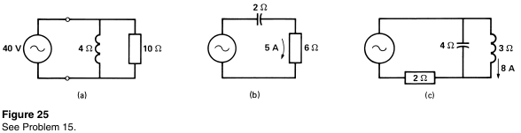

# Skyler MacDougall

## Homework 3: due 2/3/2020

12. A single-phase motor draws a current of $12A$ at a power factor of $60\%$. Calculate the in phase and quadrature components of current $I_p$ and $I_q$ with respect to the line voltage. 
    $$
    I_S=12A;\ pf=0.6\\
    I_p=I_S(pf);\ I_q=I_S(sin(cos^{-1}(pf)))\\
I_p=12A\times0.6\\|\overline{\underline{I_p=7.2A}}|\\
    I_q=12A\times(sin(cos^{-1}(0.6)))=12A\times0.8\\
    |\overline{\underline{I_q=9.6A}}|
    $$

15. Using only power triangle concepts and without drawing any phasor diagrams, calculate the impedance of the circuits below.

    

    1. $$
        Q_L={V^2\over X_L}={(40V)^2 \over 4\Omega}=400VAR\\
        P={V^2\over R}={(40V)^2\over 10\Omega}=160W\\
        S=\sqrt{P^2+Q^2}=\sqrt{(160W)^2+(400VAR)^2}\\
        S\approx431VA\\
        Z={V^2\over S}\angle(cos^{-1} ({P\over S}))={(40V)^2 \over 431VA} \angle (cos^{-1}({160W\over 431VA}))\\
        |\overline{\underline {Z \approx 3.71\Omega \angle 68^\circ}}|
        $$

    2. $$
        Q_L=I^2X_C=(5A)^22\Omega=-50VAR\\
        P=I^2R=(5A)^26\Omega=150W\\
        S=\sqrt{P^2+Q^2}=\sqrt{(150W)^2+(-50VAR)^2}\\
        S\approx158VA\\
        Z={S\over I^2}\angle(cos^{-1} ({P\over S}))={158VA \over (5A)^2} \angle (cos^{-1}({150W\over 158VA}))\\
        |\overline{\underline {Z \approx 6.3\Omega \angle 18^\circ}}|
        $$

    3. $$
        Q_L=I^2X_C=(5A)^22\Omega=-50VAR\\
        P=I^2R=(5A)^26\Omega=150W\\
        S=\sqrt{P^2+Q^2}=\sqrt{(150W)^2+(-50VAR)^2}\\
        S\approx158VA\\
        Z={S\over I^2}\angle(cos^{-1} ({P\over S}))={158VA \over (5A)^2} \angle (cos^{-1}({150W\over 158VA}))\\
        |\overline{\underline {Z \approx 6.3\Omega \angle 18^\circ}}|
        $$

20. If a $500VAR$ is put in parallel with a $3840VA; pf=0.72$ motor, calculate

    1. Active power.
        The active power is unchanged at $2765W$, because the only thing we added was a capacitor, which is purely reactive power. 

    2. The apparent power of the system.
        $$
        S=\sqrt{P^2+Q^2};\ P=2765W;\\ Q_C=-500VAR;\ Q_L \approx 2664VAR\\
        S=\sqrt{(2765W)^2+(2664-500VAR)^2}\\sqrt((2765^2)+(answer(18)−500)^2)
        |\underline{\overline{S\approx3511VA}}|
        $$

    3. The power factor of the system.
        $$
        pf={P\over S};\ P=2765W;\ S=3511VA\\
        pf={2765W\over3511VA}\\
        |\overline{\underline{pf\approx0.79}}|
        $$

21. A coil having a reactance of $10\Omega$ and a resistance of $2\Omega$ is connected in parallel with a capacitive reactance of $10\Omega$. If the supply voltage is $200V$, calculate

    1. The reactive power generated by the coil
        $$
        Q={V^2\over X_L}={(200V)^2\over 10\Omega}\\
        |\overline{\underline{Q=4kVAR}}|
$$
        
    2. The reactive power generated by the capacitor
$$
        Q={V^2\over X_C}={(200V)^2\over 10\Omega}\\
    |\overline{\underline{Q=-4kVAR}}|
    $$
        
    3. The active power dissipated by the coil
        $$
    P={V^2\over R}={(200V)^2\over 2\Omega}\\
        |\overline{\underline{P=20kW}}|
    $$
        
    4. The apparent power of the circuit
        $$
        S=\sqrt{P^2+(\sum Q)^2}\\
        S=\sqrt{(20kW)^2+(4kVAR-4kVAR)^2}\\
        |\overline{\underline{S=20kVA}}|
        $$

26. A capacitor bank has a resistor connected to it, to dissipate voltage after its been disconnected. It should have $\le50V$ after 1 minute of disconnection. Calculate the discharge resistance required for a $30kVAR,\ 480V$ capacitor. Then, calculate the wattage rating for the resistor.

$$
30kVAR;\ 480V;\ C\approx345\mu F\\
V(0)=480V;\ V_0=480V\\
V_0e^{-t\over RC}=V(t)\\
R={60\over \approx345\mu F (ln({5\over48}))}\\
R\approx76k\Omega\\
P={V^2\over R}={480^2\over 76k\Omega}\\
|\overline{\underline{R\approx76k\Omega;\ P\approx3W}}|
$$

