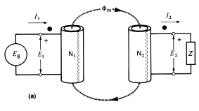
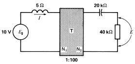

# Skyler MacDougall

## Homework 4: due 2/10/2020

4. The ideal transformer below has 500 turns on the primary and 300 turns on the secondary. 
    
    The source produces a voltage $E_g=600V$ and the load is $Z=12\Omega$. Calculate

    1. The voltage $E_2$
        $$
        {N_1\over N_2}=a={E_1\over E_2}\\
        {500\over 300}={600V\over E_2}\\
        E_2={600V\times3\over5}\\
        \overline{\underline{|E_2=360V|}}
        $$
        The current $I_2$
        $$
        I_2=({360V\over 12\Omega})\\
        \underline{\overline{|I_2=30A|}}
        $$
        
        The current $I_1$
        $$
        {I_2\over I_1}=a\\
        {3\over5}={30A\over I_1}\\
    I_1={5\times30A\over 3}\\
        \overline{\underline{|I_1=50A|}}
        $$
        
    2. The power delivered to the primary [$W$]
    $$
    P=IV\\
        P=50A\times600V\\
    \overline{\underline{|P=30kW|}}
    $$
    
    3. The power output from the secondary [$W$]
        $$
        P=IV\\
        P=60A\times 360V\\
        \overline{\underline{|P=21.6kW|}}
        $$

5.  In problem 4, what is the impedance seen by the source $E_g$?
    $$
    R_2={a^2R_1}\\
    R_2={({5\over3})^2\times12\Omega}\\
    \overline{\underline{|R=33\Omega|}}
    $$
    
6. In the circuit below, calculate the voltage across the capacitor and the current flowing through it.
    

$$
{R_{real}\times a^2}=R_{observed}\\
45k\Omega\angle26^\circ\times ({1\over100})^2=R_{observed}\\
R_{observed}=4.5\Omega\angle26^\circ\\[16pt]
R_s=4\Omega;\ X_C=2\Omega;\ X_L=5\Omega;\ Z_s=5\Omega\angle53^\circ\\
I={V\over R}\\
I={10V\over 5\Omega\angle53^\circ}\\
I=4A\angle53^\circ\\[16pt]
{I_2\over I_1}={V_1\over V_2}=a\\
{I_2\over 4A}={10V\over V_2}={1\over 100}\\
\overline{\underline{|V_2=1kV;\ I_2=40mA|}}
$$

